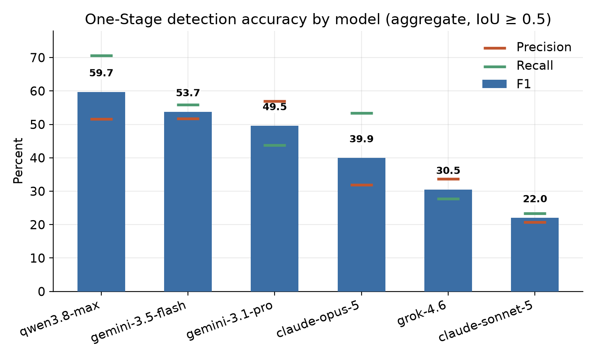
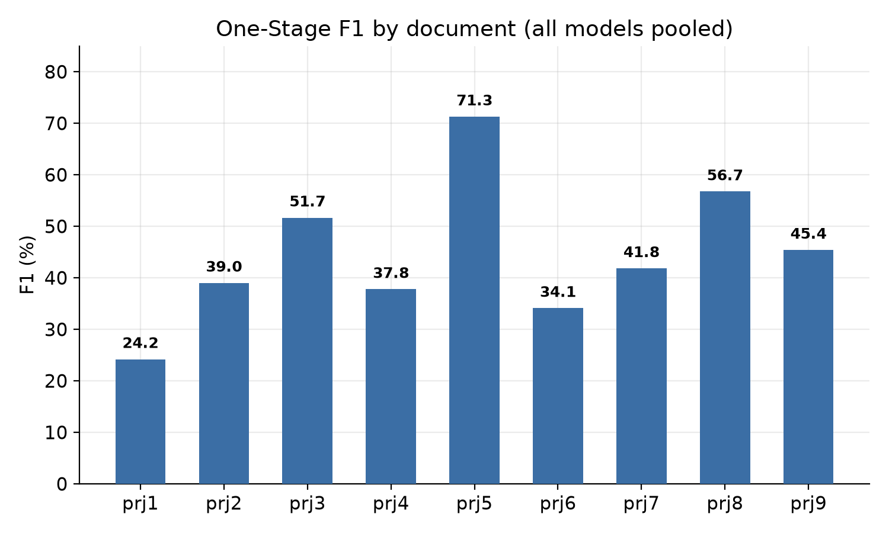
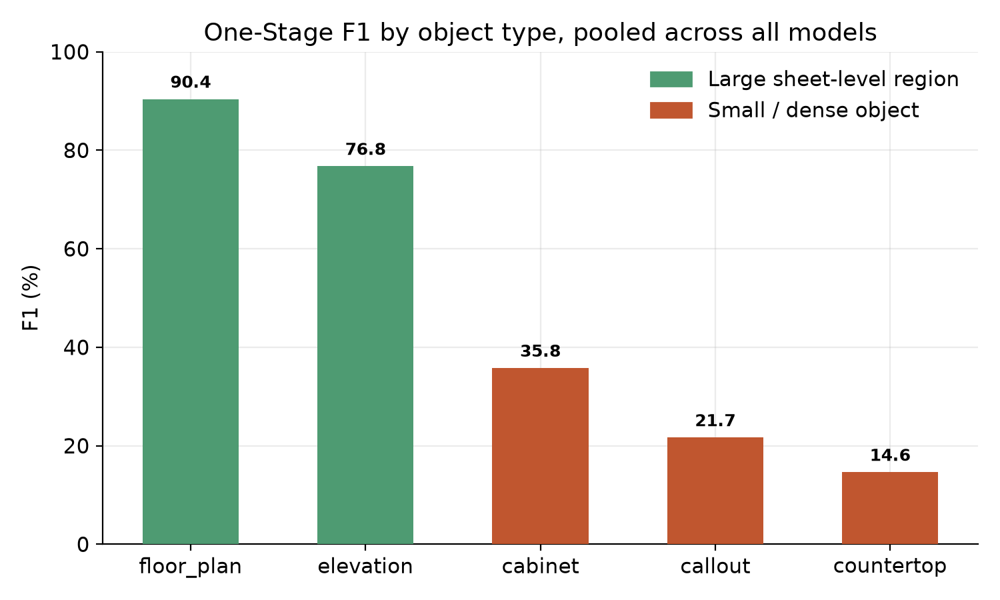
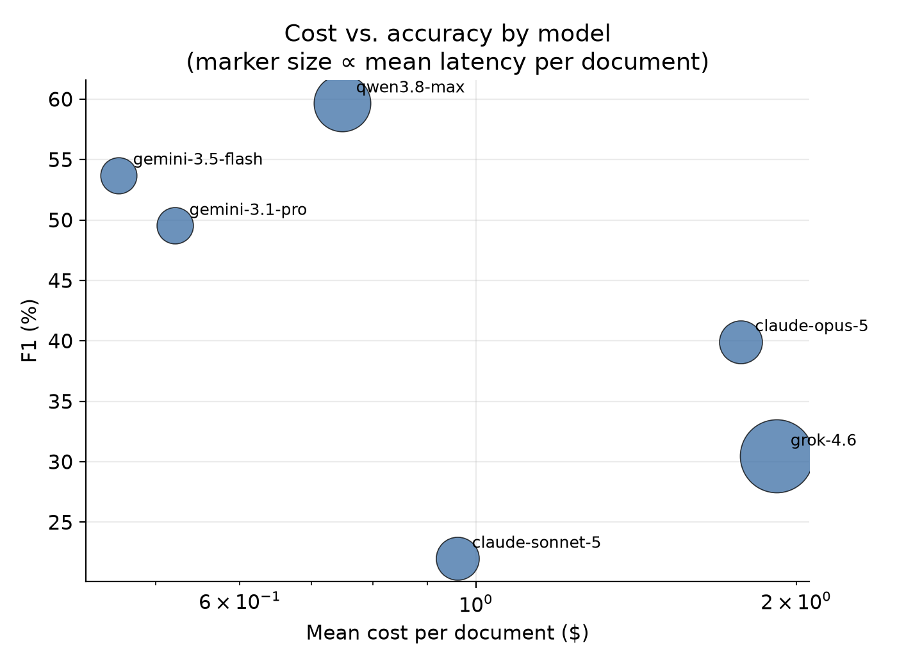

# Single-Pass Vision-Language Model Prompting for Object Localization in Architectural Millwork Drawings

*VERSION BY 31.08.26*

*TRIMED DATASET*

*Draft — Section 1 of N. Author list intentionally omitted pending author confirmation.*

## Abstract

Architectural millwork and casework drawing sets — cabinet/casework elevations, floor
plans, and reflected ceiling plans — are dense, low-redundancy technical documents that
general-purpose vision-language models (VLMs) receive no domain-specific training for.
We study whether an off-the-shelf, non-fine-tuned VLM can nonetheless localize the
objects on such a sheet from a single instruction prompt and a single full-page image
per request ("One-Stage" detection), and at what accuracy, latency, and dollar cost.
We introduce **CaseV-Bench**, a benchmark built around five object categories —
`elevation`, `floor plan`, `cabinet`, `countertop`, and `callout` — hand-annotated on
real construction-document PDFs, and evaluate six current VLMs from four providers
(Google, Anthropic, OpenAI-compatible, and Alibaba/Qwen families) under one fixed
single-pass prompting protocol, scored by greedy IoU matching against ground truth at
IoU ≥ 0.5 with real, provider-reported per-request dollar cost. Across nine annotated
sheet sets (1,353 ground-truth objects), aggregate micro-averaged F1 is **42.8%**,
ranging from **22.0%** to **59.7%** across models — a wide enough spread that model
choice is at least as consequential as prompt design. We report per-model and
per-document results, quantify two structural bottlenecks specific to this domain —
per-model image-resolution ceilings and a model-specific coordinate-reporting failure —
and outline what a higher-cost, human-in-the-loop two-pass variant of the same task
buys in return (§9, reserved). We conclude that single-pass VLM prompting is a viable
assisted-review signal for this document class but not yet an unattended extraction
step, and identify the specific failure modes — small, densely packed objects and
per-model coordinate reliability — that bound its current accuracy.

## 1. Introduction

Automating even a first-pass inventory of the casework objects on an architectural
millwork sheet — which elevations exist, which cabinets and countertops they contain,
which plan-view callouts point to which elevation — is a plausible assisted-review task
for a vision-language model. It is also a genuinely hard one: the objects of interest
are small relative to the sheet, densely packed, and drawn with domain-specific
conventions (solid vs. dashed lines, front-view-only annotation rules, section vs.
elevation distinctions) that a model trained on general-purpose imagery has no special
exposure to. Unlike natural-image object detection, there is no large labeled corpus of
architectural millwork drawings to fine-tune against, which makes zero-shot, prompted
detection with a general-purpose VLM the only readily available approach — and raises
the question of how far that approach actually gets.

This paper focuses on the cheapest and most direct way to ask a VLM to do this: send it
one full-page raster image and one instruction prompt per request, and ask it to return
every object of every type it finds, in one pass ("One-Stage" detection, §4). This is
the object of active development in the underlying project because it is the
lowest-cost, lowest-latency configuration by a wide margin, and the central empirical
question is how much of its accuracy gap against a more expensive, multi-pass,
human-in-the-loop alternative can be closed by prompt design and per-model
configuration alone, without changing its one-request-per-page architecture.

Concretely, this paper asks:

1. **How accurately** can a current, general-purpose VLM localize five categories of
   millwork objects from one full-page image and one prompt, with no fine-tuning and no
   task-specific training data?
2. **Does model choice matter more than prompt engineering?** — i.e., given a single,
   carefully iterated prompt held fixed across models, how much does measured accuracy
   vary by model alone?
3. **What does an accurate-enough configuration cost**, in dollars and wall-clock
   latency, per document — using real, provider-billed cost rather than a
   token-count estimate?
4. **What holds single-pass detection back**, structurally — is the bottleneck image
   resolution, prompt specification, or something specific to how a given model reports
   coordinates?

We answer these with a benchmark (§3), a fully specified detection method and prompt
(§4), a fixed evaluation protocol (§5), and results across six models and nine
documents (§6), followed by a discussion of failure modes and limitations (§7–§8). A
companion section reserved for comparison against a two-pass, human-in-the-loop variant
of the same task is included as §9 and left for a later revision of this draft.

## 2. Related Work

**Visual grounding with general-purpose VLMs.** Localizing objects by asking a
general-purpose VLM to emit a bounding box — rather than training a dedicated detector
— is an active but still unreliable capability. Recent grounding benchmarks report that
strong general-purpose models are markedly weaker at precise coordinate output than
either specialized grounding models or the same models' own perceptual/reasoning
performance would suggest, with accuracy that degrades further as objects get smaller or
the image gets more cluttered [1, 2]. This matches the central empirical constraint this
paper works within: the object types considered here (`cabinet`, `countertop`
especially) are small and densely packed, precisely the regime where general-purpose VLM
grounding is weakest.

**Symbol and object detection in engineering/architectural drawings.** A separate line
of work treats this as a conventional supervised object-detection problem: YOLO-family
and transformer detectors trained on labeled corpora of engineering or floor-plan
drawings report strong accuracy (mAP@50 in the 80%+ range is typical) on the symbol
classes they are trained for [3, 4]. That accuracy is bought with a labeled training set
specific to the drawing convention and symbol vocabulary in question — an asset this
project does not have, and one that is expensive to build for a narrow, evolving
taxonomy (§3 below describes ours). The approach evaluated in this paper trades that
training cost for a zero-shot general-purpose model, at a currently much lower measured
accuracy (§6); how much of that gap a small amount of task-specific supervision would
close is outside this paper's scope.

**VLM-based document intelligence.** Broader surveys of LLM/VLM use in document
understanding cover layout analysis, OCR-free document QA, and structured extraction
from visually rich documents, and describe zero-shot, single-request-per-page prompting
(as used here) as one point in a design space that also includes retrieval-augmented and
multi-stage pipelines [5, 6]. This paper differs from that broader literature in scope
rather than approach: it evaluates one narrow, densely-annotated document class
(architectural millwork drawings) against real, human-produced ground truth with
IoU-based localization scoring, rather than end-to-end extraction accuracy or QA
correctness.

To the authors' knowledge, no existing benchmark evaluates general-purpose,
non-fine-tuned VLMs specifically on object localization within architectural millwork
drawing sets under a controlled single-pass prompting protocol with provider-billed cost
accounting — the gap this paper's benchmark is built to fill.

## 3. Dataset

### 3.1 Source documents

CaseV-Bench's current evaluation set consists of nine real millwork/casework drawing
sets, submitted as multi-page PDFs. Documents vary substantially in length and object
density — from a 2-page, 48-object set (`trim_prj2`) to a 34-page, 234-object set
(`trim_prj7`) — which is a deliberate property of the dataset, not an artifact: it lets
per-document difficulty (§6.2) separate "hard because dense" from "hard because large."

| Document | Pages | GT objects |
|---|---:|---:|
| `trim_prj1` | 3 | 74 |
| `trim_prj2` | 2 | 48 |
| `trim_prj3` | 7 | 34 |
| `trim_prj4` | 9 | 241 |
| `trim_prj5` | 2 | 80 |
| `trim_prj6` | 24 | 323 |
| `trim_prj7` | 34 | 234 |
| `trim_prj8` | 29 | 231 |
| `trim_prj9` | 9 | 94 |
| **Total** | **119** | **1,353** |

All PDFs are rendered to raster images at request time by the application itself, never
pre-rendered, so every run controls its own DPI and, optionally, a post-render maximum
pixel dimension — the same source PDF can be re-rendered at whatever resolution a given
model needs (§4.3).

### 3.2 Object taxonomy

Ground truth and the detection prompt (§4) target five object types. Definitions below
are condensed from the live detection prompt's own type specifications, which are
themselves derived from a written annotation-rules reference authored by the project's
domain reviewers:

| Label | Definition (condensed) |
|---|---|
| `elevation` | A detailed orthographic view of one object, assembly, or wall, from a single direction — front, back, side, or top. Judged by geometry and scope (one assembly, one direction), not by caption wording. Excludes sections and floor plans. |
| `floor_plan` | A top-down view of a room or overall space — walls, boundaries, and layout seen from above. A top-down view of a single object/assembly is `elevation`, not `floor_plan`; the deciding axis is scope (room vs. single assembly). |
| `cabinet` | One built-in or freestanding storage unit with an enclosed body, annotated only in **front view**. The box covers the cabinet body only — not the countertop/backsplash above it, not the wall or ceiling above a wall cabinet, not adjoining units in the same run. |
| `countertop` | A horizontal work surface on cabinets or on its own legs/brackets, annotated only in **front view**; a backsplash is included in the same box where present. |
| `callout` | A small circular/diamond symbol, with or without a pointer triangle or leader line, referencing a page/elevation/section elsewhere in the set. Explicitly excludes a *view title bubble* — a circle attached to the left end of a view's own underlined title — even when its contents look identical to a real callout; the distinguishing signal is attachment, not content. |

A sixth category, `section` (a wide cross-sectional cutaway), is explicitly **excluded
from annotation**, including any cabinet, countertop, or callout that is visible only
inside one — those are annotated on their own separate front-view elevation instead.
Every box, of every type, is required to be **tight**: each of its four edges touches
the object's own outermost drawn line, with no padding.

By ground-truth object count, the taxonomy is dominated by `callout` (480, 35.5%) and
`elevation` (300, 22.2%), with `floor_plan` (166, 12.3%), `cabinet` (317, 23.4%), and
`countertop` (90, 6.7%) making up the rest. `callout`'s share is inflated by two
outlier-dense documents (`trim_prj4`: 181 of 241 objects; `trim_prj8`: 130 of 231) that
contain long runs of plan-view reference symbols; excluding those two documents, the
label distribution is closer to even across the five types.

### 3.3 Ground-truth format and coordinate convention

Ground-truth boxes are measured in the page's own coordinate space (PDF points at 72 pt
per inch), never in pixels of whatever DPI a given run renders at — normalizing a
ground-truth box against render pixels instead of native point size would silently
shrink every box by a factor of `(dpi / 72)`, large enough at typical rendering DPIs
(180–500) to collapse true-positive counts toward zero while producing no visible error.
Every scoring path derives each page's native point dimensions independently of the DPI
used for a given model call, and normalizes ground truth against that.

## 4. Method: One-Stage detection

One-Stage detection is the direct approach: a single request, carrying one full-page
sheet image and one fixed instruction prompt, asks the model to find every object of
every type on that page and report its label and box. No fine-tuning, few-shot examples,
or task-specific training data are used — the prompt is the entire mechanism by which
the model is told what to look for and how to report it. This section specifies that
prompt structurally; its full text is reproduced verbatim in Appendix A.

### 4.1 Task framing

The prompt opens by naming the document class explicitly (an AEC drawing sheet that may
hold several drawing views at very different scales — a floor plan or elevation filling
a quadrant of the sheet, a callout a tiny symbol within it) and states the task as
**multi-class localization**: find and box every instance of the five types in §3.2,
tag each with its label, and report large regions and small symbols side by side in the
same pass. Boxes of different types are explicitly permitted to overlap — a cabinet sits
inside its elevation, a callout sits inside a floor plan — and the model is told this is
expected, not an error to resolve by merging or dropping one of the two.

### 4.2 Disambiguation rules

Beyond the five per-type definitions (§3.2), the prompt carries rules aimed
specifically at cases the underlying reference distinguishes but a generic reading of
the definitions would not catch:

- **`floor_plan` vs. `elevation`** is scoped by *what the view covers*, not by view
  direction: a top-down view of a whole room is `floor_plan`; a top-down view of one
  object or assembly is still `elevation`. A same-direction view can land on either side
  of that line depending on scope alone.
- **`section` is out of scope entirely**, and so is anything drawn only inside one — a
  cabinet, countertop, or callout visible solely within a cross-sectional cutaway is not
  annotated there; it is expected to also appear on its own separate front-view
  elevation elsewhere on the sheet, which is where it is annotated instead.
- **`callout` vs. view title bubble** is the prompt's most detailed disambiguation rule,
  because the two can be textually identical: a callout and a title bubble can both read
  as a bare number or a number over a sheet ID. The prompt states explicitly that content
  does not decide — *attachment* does. A circle fused to the left end of a view's own
  underlined title is a title bubble, never a callout, regardless of what is written
  inside it.
- **Cabinet/countertop box edges are defined operationally, not just by object
  identity.** For a base cabinet, the box's top edge is the line directly under the
  countertop — the countertop and any backsplash are explicitly excluded from the
  cabinet's own box. For a wall cabinet, the top edge is the cabinet's own top line, never
  the wall or ceiling area above it. The prompt gives a standing self-check: before
  emitting a box, verify that the region between its top edge and the object's own top
  line contains nothing that belongs to a different object; if it does, shrink the box.

### 4.3 Coordinate and output contract

Coordinates are requested as **normalized fractions in [0, 1]** of the image actually
sent, independently on each axis, origin at the top-left corner — i.e. a plain
`x_min/y_min/x_max/y_max` fraction, not a 0–1000 integer scale or a pixel coordinate.
Each detection is one JSON object of the shape:

```json
{"label": "cabinet",
 "bounding_box": {"x_min": 0.12, "y_min": 0.34, "x_max": 0.20, "y_max": 0.41}}
```

with `label` constrained to exactly one of the five taxonomy strings (§3.2; `floor_plan`
spelled with an underscore) and the model instructed to return a bare JSON array of such
objects — no prose, no markdown code fences, and an explicit empty array `[]` when a
page contains none of the five types. No count or summary field is requested; consistent
with the rest of the project's detection methods, object counts are treated as something
to be recomputed from the final object list rather than trusted from the model.

### 4.4 Execution pipeline

The results reported in §6 were produced by a separate execution harness from the one
described in the project's internal engineering documentation for earlier prompt
iterations; this paper reports the prompt itself (§4.1–§4.3, Appendix A) and the
resulting scored detections (§5–§6) with confidence, since both are recoverable directly
from the shared results table each run was written to. The harness's own execution
parameters — rendering DPI, request granularity (per page vs. per document), and
retry/repair behavior for malformed model output — are not independently documented as
of this draft and are called out explicitly in §7 as an open item rather than assumed
from other parts of the project.

## 5. Evaluation protocol

### 5.1 Matching and metrics

Scoring is performed by a shared internal package, `location-scorer` (version
`v0.1.0`, identical across every run reported in this paper), so that a difference in
measured accuracy reflects the detection approach and model, not a difference in how it
was scored. For each page, predicted and ground-truth boxes are bucketed by `(page,
object_type)` and matched greedily by IoU; a match counts as a true positive at or above
a fixed **IoU threshold of 0.5**, with unmatched predictions counted as false positives
and unmatched ground-truth objects as false negatives.

Precision, recall, and F1 are reported as **aggregate ("overall") metrics** — true
positives, false positives, and false negatives summed across every document first, then
divided once (micro-averaged), not averaged per-document. This is a deliberate choice:
under a per-document average, a small, easy-to-perfect document would count equally with
a large, hard one, which is not the summary statistic of interest for a
deployment-oriented question ("how many objects, in total, does this configuration find
correctly"). Per-object-type and per-page breakdowns are computed by the same scorer and
retained per run, but are not used as the headline number in §6 for the same reason.

Beyond the binary match outcome, the scorer retains two continuous signals used in §7 to
diagnose *why* a configuration scores the way it does: the IoU of every true-positive
match (how tightly a landed box hugs the real object), and the best available IoU of
every false positive against any ground-truth box on that page (how close a miss
actually was). This separates "the box is loose but roughly in the right place" from
"the box is nowhere near any real object" — two very different failure modes that a
bare F1 number collapses into one.

### 5.2 Cost and latency instrumentation

Every scored run in this paper carries the **actual dollar cost charged for that
specific request**, as reported by the model provider through OpenRouter's per-request
usage accounting, rather than an estimate computed from a locally maintained token-price
table. This keeps reported cost correct as provider pricing changes and comparable across
models and providers without this paper needing to track pricing itself. Wall-clock
latency is recorded per run alongside cost. A scoring failure (e.g. no ground truth
available for a document) is isolated from the detection result itself and does not
appear in the tables in §6.

## 6. Results

All results below are for the current, best-performing One-Stage prompt (§4, Appendix
A), evaluated on all nine documents (§3.1, 1,353 ground-truth objects) with six models.
Where a (model, document) pair was run more than once, the most recent run is used
(§6.6 notes this as a scope decision, not a hidden average). Aggregate metrics are
micro-averaged (§5.1): true positives, false positives, and false negatives are summed
across all documents before precision/recall/F1 are computed once, so one large document
does not get outweighed by several small ones.

### 6.1 Headline — accuracy by model

| Model | TP | FP | FN | Precision | Recall | **F1** | Total cost | Mean latency / doc |
|---|---:|---:|---:|---:|---:|---:|---:|---:|
| `qwen3.8-max` | 956 | 895 | 397 | 51.6% | 70.7% | **59.7%** | $6.73 | 178.7 s |
| `gemini-3.5-flash` | 756 | 706 | 597 | 51.7% | 55.9% | **53.7%** | $4.15 | 28.5 s |
| `gemini-3.1-pro-preview` | 593 | 448 | 760 | 57.0% | 43.8% | **49.5%** | $4.69 | 29.7 s |
| `claude-opus-5` | 722 | 1,542 | 631 | 31.9% | 53.4% | **39.9%** | $15.97 | 70.5 s |
| `grok-4.6` | 376 | 740 | 977 | 33.7% | 27.8% | **30.5%** | $17.24 | 346.9 s |
| `claude-sonnet-5` | 316 | 1,205 | 1,037 | 20.8% | 23.4% | **22.0%** | $8.65 | 71.0 s |
| **All models pooled** | 3,719 | 5,536 | 4,399 | 40.2% | 45.8% | **42.8%** | $57.44 | — |



Two things stand out. First, **the spread across models is wide** — 22.0% to 59.7% F1,
a 2.7× range — for the *same* prompt, the *same* documents, and the *same* IoU
threshold; model choice is at least as consequential as anything in prompt design (§4).
Second, **the ranking does not track provider "flagship" status**: `qwen3.8-max` is the
strongest model in this evaluation, while `claude-sonnet-5` is the weakest overall
despite sharing a provider and model family with the mid-ranked `claude-opus-5`. Recall
varies more across models than precision does (23.4–70.7%, a 47-point range, vs.
20.8–57.0%, a 36-point range), suggesting a meaningful share of the ranking is driven by
how much of a dense sheet a model keeps scanning rather than by how tightly it places
the boxes it does report.

### 6.2 Per-document difficulty

| Document | Pages | GT objects | F1 (all models pooled) |
|---|---:|---:|---:|
| `trim_prj1` | 3 | 74 | 24.2% |
| `trim_prj2` | 2 | 48 | 39.0% |
| `trim_prj3` | 7 | 34 | 51.7% |
| `trim_prj4` | 9 | 241 | 37.8% |
| `trim_prj5` | 2 | 80 | **71.3%** |
| `trim_prj6` | 24 | 323 | 34.1% |
| `trim_prj7` | 34 | 234 | 41.8% |
| `trim_prj8` | 29 | 231 | 56.7% |
| `trim_prj9` | 9 | 94 | 45.4% |



Difficulty does not track document size in either direction: both the easiest document
(`trim_prj5`, F1 71.3%, 2 pages) and the hardest (`trim_prj1`, F1 24.2%, 3 pages) are
among the three smallest documents in the set. The three largest documents span almost
the entire range instead of clustering together: `trim_prj8` (29 pages) is the
second-best result (56.7%), `trim_prj7` (34 pages) sits near the median (41.8%), and
`trim_prj6` (24 pages) is the second-worst (34.1%). Object *density* and *type mix*
(§6.3) appear to matter more for this configuration than page count or raw object count
per se; a per-document type breakdown is left for a future revision of this draft.

### 6.3 Accuracy by object type

| Type | TP | FP | FN | Precision | Recall | **F1** |
|---|---:|---:|---:|---:|---:|---:|
| `floor_plan` | 903 | 99 | 93 | 90.1% | 90.7% | **90.4%** |
| `elevation` | 1,296 | 281 | 504 | 82.2% | 72.0% | **76.8%** |
| `cabinet` | 647 | 1,068 | 1,255 | 37.7% | 34.0% | **35.8%** |
| `callout` | 801 | 3,715 | 2,079 | 17.7% | 27.8% | **21.7%** |
| `countertop` | 72 | 373 | 468 | 16.2% | 13.3% | **14.6%** |



The two large, sheet-level region types (`floor_plan`, `elevation`) score 76.8–90.4%
F1; the three small/dense object types (`cabinet`, `callout`, `countertop`) score
14.6–35.8% — roughly a 2–6× gap. This is the same pattern the visual-grounding
literature reports for general-purpose VLMs more broadly (§2): accuracy degrades sharply
as objects get smaller relative to the image and more densely packed, and this
benchmark's own worst-performing type, `countertop`, is exactly that — a thin,
easily-confused band that is only ever a small fraction of the sheet.

Per-model, the ranking established in §6.1 is not uniform across types:

| Model | `elevation` | `floor_plan` | `cabinet` | `countertop` | `callout` |
|---|---:|---:|---:|---:|---:|
| `qwen3.8-max` | 90.4% | **97.9%** | **60.3%** | **32.4%** | **42.1%** |
| `gemini-3.5-flash` | 89.6% | 96.4% | 45.3% | 16.5% | 32.8% |
| `claude-opus-5` | 88.7% | 95.5% | 51.2% | 18.8% | 13.2% |
| `gemini-3.1-pro-preview` | 75.6% | 88.0% | 40.8% | 8.7% | 33.3% |
| `grok-4.6` | 68.7% | 91.4% | 5.4% | 7.4% | 0.2% |
| `claude-sonnet-5` | 47.3% | 73.0% | 9.7% | 0.0% | 4.7% |

`qwen3.8-max`'s overall lead (§6.1) is not concentrated in one easy type — it is the
single best model on every one of the five types, including the two hardest
(`countertop`, `callout`). `grok-4.6` and `claude-sonnet-5` are the mirror case: both
score far higher on the two large region types (47.3–91.4% F1) than on any small object
type, and both collapse on small objects specifically (`cabinet` 5.4–9.7%, `countertop`
0.0–7.4%, `callout` 0.2–4.7%) — a much steeper large-vs-small drop-off than the other
four models show. §6.4 examines whether this is a placement-precision problem or a
detection problem and finds it is mostly the latter.

### 6.4 Precision of placement vs. failure to detect

The scorer retains two continuous signals beyond the binary match outcome (§5.1): the
IoU of every true-positive match, and the best available IoU of every false positive
against any ground-truth box on the same page. Splitting these apart tests a specific
hypothesis raised by §6.3's large-vs-small gap: is a weak model's small-object score low
because its boxes are loose (found the object, placed it imprecisely) or because it
mostly does not report the object at all (never found it)?

| Model | Mean IoU of matches | FPs nowhere near a GT box (best IoU < 0.10) |
|---|---:|---:|
| `qwen3.8-max` | 0.785 | 79.1% |
| `gemini-3.5-flash` | 0.779 | 52.3% |
| `gemini-3.1-pro-preview` | 0.770 | 46.2% |
| `claude-opus-5` | 0.747 | 73.9% |
| `grok-4.6` | 0.720 | 60.8% |
| `claude-sonnet-5` | 0.700 | 65.6% |

Mean IoU of matches is close across all six models (0.700–0.785) — including
`grok-4.6` and `claude-sonnet-5`, the two weakest models on small objects overall. When
these two models *do* find a small object, they box it about as tightly as any other
model does; `claude-sonnet-5` reports **zero** true-positive `countertop` matches
across all nine documents (§6.3, 0.0% F1) rather than a large number of loose,
low-IoU ones. This weighs against the box-precision hypothesis from §6.3: the dominant
failure mode for the weakest models on small object types is **not reporting the object
at all** (a recall/detection failure), not placing a low-quality box around an object
they did find. The nowhere-near-any-object share of false positives does not cleanly
separate strong models from weak ones either — `qwen3.8-max`, the strongest model
overall, has the *highest* rate of wildly misplaced false positives (79.1%) of any
model in the set, which suggests it compensates for a noisier detection process with a
much higher detection rate rather than a cleaner one. Confirming *why* small-object
recall specifically degrades for some models (a genuine perception limit vs. a
prompt-following one) is not resolved by this data and is noted as an open question in
§7.

### 6.5 Cost and latency



The three cheapest models by mean cost per document — `gemini-3.5-flash` ($0.46/doc),
`gemini-3.1-pro-preview` ($0.52/doc), and `qwen3.8-max` ($0.75/doc) — are exactly the
three most accurate models in §6.1 (49.5–59.7% F1). Cost alone does not fully explain
the ranking, though: `claude-sonnet-5` is the fourth-cheapest model ($0.96/doc) yet the
*least* accurate of the six (22.0% F1), while the two most expensive models per document
— `claude-opus-5` ($1.77/doc) and `grok-4.6` ($1.92/doc) — land in the middle and bottom
of the accuracy ranking respectively, not at the top. `grok-4.6` is the worst value in
the evaluation on every axis at once: the highest cost per document, by far the
highest mean latency (346.9 s/doc — 2–12× every other model), and only the
second-lowest F1. `qwen3.8-max`'s accuracy lead (§6.1) comes at a real latency cost
(178.7 s/doc, second-slowest of the six) but not a dollar-cost one — at $0.75/doc it
remains the third-cheapest model evaluated.

### 6.6 Scope notes

Two caveats on how these numbers were produced, stated explicitly since they affect how
much weight to put on small differences:

- **One run per (model, document) pair**, taken as the most recent when a pair was run
  more than once; no repeated-trial variance estimate is available from this data.
  Differences of a few F1 points between two models should not be read as
  statistically distinguished from noise; the differences this section leads with (the
  2.7× model spread in §6.1, the 2–6× type gap in §6.3) are much larger than that.
- **Coverage across (model, document) pairs was not perfectly uniform** in the
  underlying run history — some pairs were run more than once before the most-recent-run
  rule above was applied, for reasons not recorded in the data available for this draft.
  Every model was ultimately evaluated on all nine documents, so the headline numbers in
  §6.1 are not affected by missing cells.

## 7. Limitations

**The small-object failure mode is identified but not explained.** §6.4 shows that the
weakest models' collapse on `cabinet`/`countertop`/`callout` is primarily a *detection*
failure (the object goes unreported) rather than a *placement* failure (a loose but
present box) — but this data cannot distinguish between the two most likely underlying
causes: a genuine perception limit (the model's vision encoder discards small-object
detail before the language model ever reasons about it, e.g. through aggressive internal
image downsampling) and a prompt-following limit (the model perceives the object well
enough but under-reports it for reasons specific to how the instructions are phrased or
how much of a long, dense list it is willing to emit). Distinguishing these would need
either a controlled resolution sweep per model or a targeted prompt ablation, neither of
which this evaluation ran.

**The execution harness that produced §6's results is not independently documented.**
As noted in §4.4, the prompt itself (Appendix A) and the scored outcomes (§6) are known
directly from the shared results this paper draws on, but the harness's own rendering
DPI, request granularity (whether a whole document or one page is sent per request), and
malformed-output retry behavior are not. Because §6.4 shows the dominant small-object
failure is a *recall* problem, and image resolution is one of the more likely causes of
a model failing to notice a small object in the first place, not knowing the rendering
DPI used per model is a real gap — a low-DPI render could produce exactly the pattern
observed even for a model that would do much better at a higher one. This paper reports
what is measured and flags what is not, rather than assuming values from unrelated parts
of the project.

**Ground truth reflects human judgment calls that are not independently verified for
agreement.** The taxonomy's most detailed disambiguation rules — `callout` vs. a view
title bubble decided by attachment rather than content, `cabinet`/`countertop` box edges
that must exclude an adjacent object even when densely packed (§4.2) — require real
judgment to annotate consistently. No second annotator pass or inter-annotator agreement
figure is reported alongside the ground truth used in §6, so some fraction of what this
evaluation scores as a false positive or false negative may reflect an ambiguous case
rather than a clear model error. This affects the absolute accuracy numbers more than
the cross-model comparison, since every model is scored against the same ground truth.

**Results are reported at a single IoU threshold (0.5) and a single run per
configuration.** §6.6 already states the run-repetition caveat; the IoU threshold choice
is a second, related one. A looser or tighter threshold would shift every number in §6
without necessarily changing the ranking, but that has not been checked, and no
statistical test accompanies any comparison in this paper — the differences led with in
§6 (a 2.7× model spread, a 2–6× type gap) are treated as self-evidently larger than
plausible run-to-run noise rather than formally tested as such.

**No fine-tuned or task-specific baseline is included.** §2 notes that supervised
detectors trained on labeled engineering-drawing corpora report substantially higher
accuracy than what is measured here for zero-shot VLM prompting. This paper does not
attempt to quantify that gap directly — CaseV-Bench's five-type taxonomy has no
comparably-sized labeled training set to fine-tune against — so the numbers in §6 should
be read as a zero-shot ceiling for this exact prompting approach, not as a statement
about what is achievable for this document class with any amount of supervision.

## 8. Conclusion

Returning to the four questions posed in §1:

1. **How accurately can a current, general-purpose VLM localize these objects?**
   Aggregate F1 is 42.8% pooled across six models, with the best single model
   (`qwen3.8-max`) reaching 59.7% — high enough on the two large, sheet-level region
   types (`floor_plan` 90.4%, `elevation` 76.8%) to be a genuinely useful first pass, and
   low enough on the three small/dense types (14.6–35.8% F1) that unattended use on
   those types is not supported by this data. Single-pass VLM prompting is best read as
   an assisted-review signal for this document class, not an unattended extraction step.

2. **Does model choice matter more than prompt engineering?** Within one fixed,
   carefully iterated prompt, F1 spans 22.0–59.7% across six models (§6.1) — a 2.7×
   range driven mostly by recall rather than precision. That range is comparable in size
   to plausible prompt-engineering gains, which means model selection is not a detail to
   fix arbitrarily and iterate the prompt around; it is a first-order lever in its own
   right, on par with the prompt itself.

3. **What does an accurate-enough configuration cost?** The three cheapest models
   evaluated are also the three most accurate (§6.5) — cost and accuracy are not in
   tension for most of this evaluation's range. The exception on both ends matters:
   `claude-sonnet-5` is cheap and the least accurate model tested, and `grok-4.6` is
   simultaneously the most expensive, the slowest by a wide margin, and second-worst on
   accuracy. Neither low cost nor high cost reliably predicts where a model lands.

4. **What holds single-pass detection back, structurally?** The dominant pattern is a
   large-vs-small object gap (§6.3) that §6.4's IoU analysis narrows to a **detection**
   problem for the weakest models — objects going unreported, not boxes landing loosely
   — though this evaluation cannot yet separate a genuine small-object perception limit
   from a prompt-following one (§7). A second, unresolved structural gap is that the
   execution harness's own rendering parameters are not documented for the specific runs
   analyzed here (§4.4, §7), which is exactly the kind of detail a resolution-limited
   failure mode would be sensitive to.

Overall, single-pass VLM prompting for architectural millwork drawing localization is a
viable starting point — model selection and the large/small object distinction matter
more than this paper can yet fully explain — and the next concrete step is closing the
harness-visibility gap in §7 so that a resolution sweep can directly test the
small-object recall hypothesis raised in §6.4, before further prompt iteration is spent
chasing a bottleneck that may not be in the prompt at all.

## 9. Two-Stage comparison

*Reserved for a later revision of this draft. The underlying project also implements a
higher-cost, human-in-the-loop two-pass detection method, and an earlier internal
comparison (on a different, four-type taxonomy and an earlier prompt version) found it
substantially more accurate than single-pass detection at several times the cost. A
comparison of Two-Stage against the current One-Stage configuration reported in §6, on
the current taxonomy and document set, has not yet been run and is left for future work.*

## References

*(Numbering is provisional and will be finalized once the reference list is complete;
full author lists to be added before submission.)*

1. LLM-Optic: Unveiling the Capabilities of Large Language Models for Universal Visual
   Grounding. arXiv:2405.17104.
2. GroundingME: Exposing the Visual Grounding Gap in MLLMs through Multi-Dimensional
   Evaluation. arXiv:2512.17495.
3. Automatic Detection and Classification of Symbols in Engineering Drawings.
   arXiv:2204.13277.
4. SkeySpot: Automating Service Key Detection for Digital Electrical Layout Plans in the
   Construction Industry. arXiv:2508.10449.
5. Document Intelligence in the Era of Large Language Models: A Survey.
   arXiv:2510.13366.
6. A Survey on MLLM-based Visually Rich Document Understanding: Methods, Challenges, and
   Emerging Trends. arXiv:2507.09861.

## Appendix A — Full One-Stage prompt text

Reproduced verbatim, as used for the runs reported in §6.

```
CONTEXT: You are looking at a full AEC drawing SHEET. It may hold several drawing views
         (floor plans, elevations, sections, details) and, within them, casework, work
         surfaces, and reference symbols. Objects appear at VERY DIFFERENT SCALES — a whole
         view fills a quadrant of the sheet; a callout is a tiny symbol.
TASK:    Multi-class localization. Find and box every instance of the FIVE object types
         below and tag each box with its `label`. Report large regions and small symbols
         alike. Boxes of DIFFERENT types may overlap (a cabinet sits inside an elevation;
         a callout sits inside a floor plan); that is expected — report each on its own.
         Do not merge different types.
TYPE 1 — label "floor_plan"  (large view region)
   A TOP-DOWN view of a room or overall space — walls, room boundaries, and layout seen
   from above. UNIT: one plan view = one box (drawing plus its title/scale text if present).
   NOT a floor plan: a detailed top view of a single object or assembly (that is an
   "elevation" — see TYPE 2); key/location plans reduced to a tiny diagram; schedules,
   legends, title block.
TYPE 2 — label "elevation"  (large view region)
   A DETAILED orthographic view of a specific object, assembly, or wall, seen from ONE
   direction — front, back, side, OR top. A detailed top view of an object is still an
   elevation, NOT a floor plan. A typical elevation has a recognizable elevation reference
   marker and usually a scale. UNIT: one titled view = one box (drawing plus its title,
   marker, and scale text). NOT an elevation: sections (see IGNORE below), floor plans,
   schedules/legends/tables, title block.
TYPE 3 — label "cabinet"  (small, blocky; front view only)
   A built-in or freestanding storage unit with an enclosed body, typically containing
   doors, drawers, shelves, or a combination. It may sit below a countertop, be mounted on
   a wall, or run floor to ceiling. Annotate ONLY cabinets shown in a FRONT view.
   UNIT: one distinct cabinet unit = one box; adjoining units in a run are separate boxes.
   BOX EDGES — the box covers ONLY the cabinet body itself, nothing above it:
     - TOP (y_min): the topmost drawn line of the cabinet body. For a base cabinet this is
       the line directly UNDER the countertop — the countertop slab and backsplash are NOT
       part of the cabinet. For a wall cabinet it is the cabinet's own top line — never the
       ceiling, soffit, or wall area above. NEVER extend the box upward into empty wall
       space or into another object.
     - BOTTOM (y_max): the floor line / bottom of toe-kick for base and tall cabinets; the
       cabinet's bottom line for wall cabinets (not the counter or wall below it).
     - SIDES: the unit's outer vertical edges.
   EXCLUDE: open shelving, wall panels, appliances, sinks, furniture, and any cabinet
   visible only from the side/profile.
TYPE 4 — label "countertop"  (thin, elongated; front view only)
   A horizontal work surface installed on top of cabinets or supported by legs, brackets,
   or another structure. Two variants, BOTH annotated as one "countertop" object:
     a) Standard countertop — the horizontal surface alone.
     b) Countertop with backsplash — includes a raised vertical section extending up the
        wall; include the backsplash inside the same box.
   Annotate ONLY countertops shown in a FRONT view; do NOT annotate countertops seen in a
   side/profile view. A countertop does not require a cabinet beneath it. Give each box a
   NON-ZERO height. Do NOT confuse with sills, trim, shelves, or soffit/floor lines.
TYPE 5 — label "callout"  (tiny symbol)
   A small circle (sometimes set in a diamond or similar shape, sometimes with a pointer
   triangle or leader line) containing short text that references a page, elevation, or
   section — e.g. a number over a sheet ID like "72 / A9.9.2", a diamond hub with view
   numbers on its sides, or a circle like "8 / AE504". Single-reference and multi-reference
   symbols BOTH count. A callout stands INSIDE or BESIDE drawing content and points AT
   something (via position, a pointer triangle, or a leader line); it is never the bubble
   fused to a view's title line — see EXCLUDE. UNIT: one whole symbol = one box (hub plus
   its attached pointer tags), NOT one box per arm.
   EXCLUDE — these look similar but are NOT callouts:
     - VIEW TITLE BUBBLES: the circle attached to the LEFT END of a view's underlined
       title text, with a scale note nearby (e.g. "(5) CONTROL ROOM 105 — SCALE: 1/2" =
       1'-0"" or "(1) CRAWL SPACE PIPING — 1/8" = 1'-0""). It NAMES the view it is
       attached to rather than referencing another view. WARNING: a title bubble may
       contain exactly the same content as a real callout — a bare number OR a number
       over a sheet ID like "5 / AE401". The contents do NOT decide; the attachment
       does. If the circle touches or immediately precedes an underlined view title,
       it is a title bubble — NEVER a callout, regardless of what is written inside it.
     - grid/column bubbles, door/window/room tags, dimension text, north arrows.
IGNORE — sections (do NOT annotate, under any label)
   A section is a wider CROSS-SECTIONAL cut — e.g. a cut-through of a building or multiple
   floors seen from the front, like a building cutaway, typically with cut/hatch marks at
   the cut line. Sections are OUT OF SCOPE: do not box them as "elevation", "floor_plan",
   or anything else. (Cabinets, countertops, and callouts drawn INSIDE a section are also
   out of scope only if they are shown in profile/cut; a true front view still counts.)
DISAMBIGUATION (view-level classes):
   - Top-down view of a ROOM or overall SPACE ............ floor_plan
   - Detailed one-direction view of an OBJECT/ASSEMBLY/WALL
     (front, back, side, or top) .......................... elevation
   - Wide cross-sectional cutaway through a building ....... section — IGNORE
BOX TIGHTNESS (all types): Every box must be TIGHT — each of its four edges touches the
   outermost drawn line of the object, with no padding and no surrounding empty space.
   Before emitting a box, verify: does the region between y_min and the object's top edge
   contain anything that is not this object (blank wall, a countertop, another cabinet)?
   If yes, shrink the box until it does not.
COORDS:  Normalized coordinates — fractions 0 to 1 of image width and height, for BOTH
         axes independently: x runs 0.0 (left edge) to 1.0 (right edge), y runs 0.0 (top
         edge) to 1.0 (bottom edge). Origin (0,0) is the TOP-LEFT corner. Box =
         [x_min, y_min, x_max, y_max] with x_min < x_max and y_min < y_max, all in [0,1].
OUTPUT:  Respond with ONLY a JSON array — no prose, no markdown fences. One object per
         detection, each shaped exactly like:
         {"label": "cabinet", "bounding_box": {"x_min": 0.12, "y_min": 0.34,
          "x_max": 0.20, "y_max": 0.41}}
         `label` MUST be exactly one of: "elevation", "floor_plan", "cabinet",
         "countertop", "callout". If nothing is found, return an empty array: [].
```
