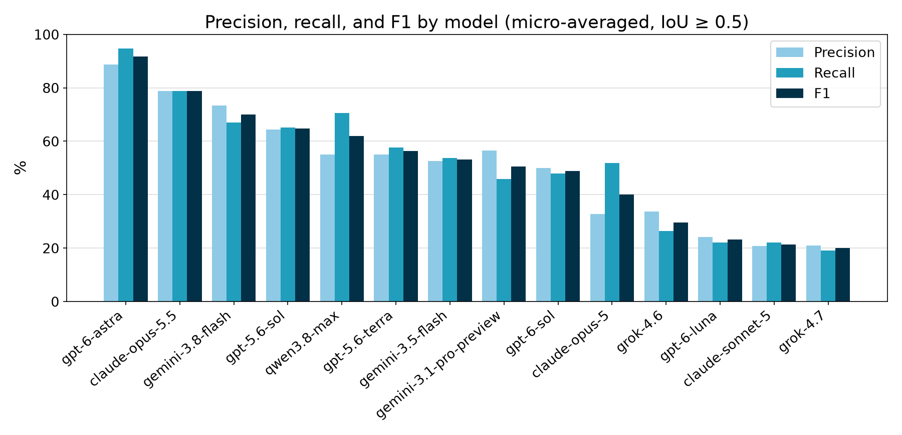
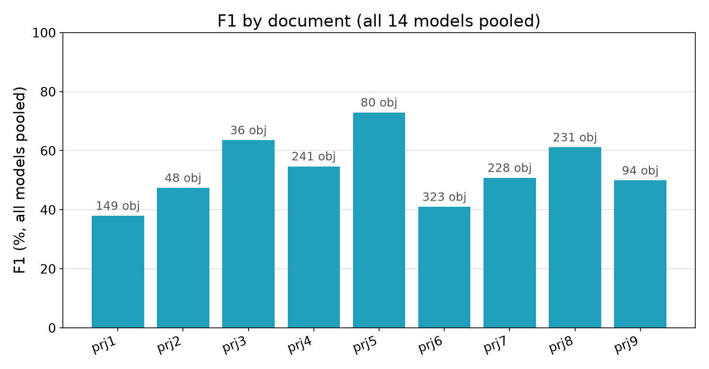
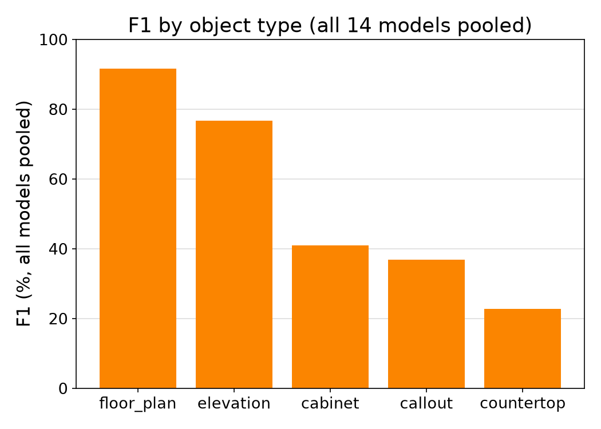
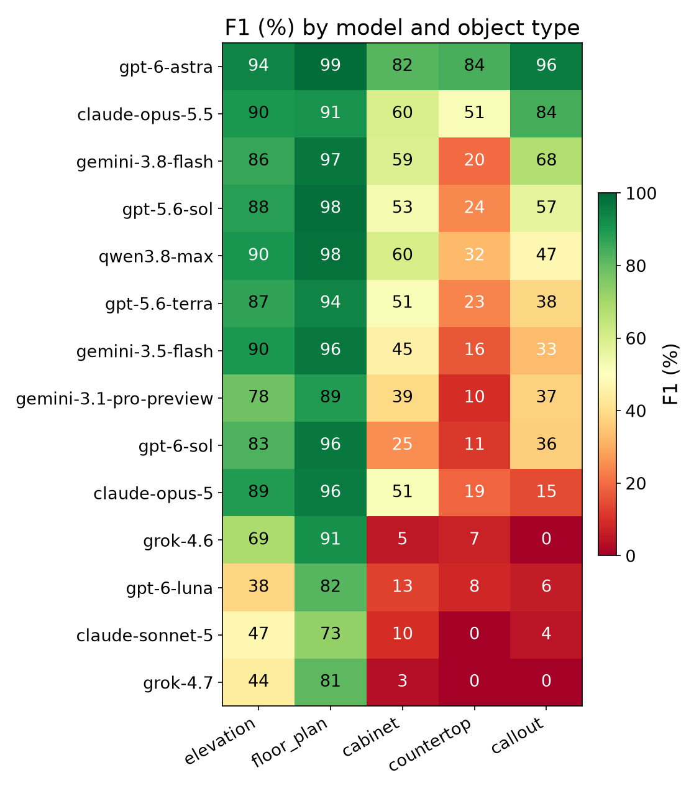
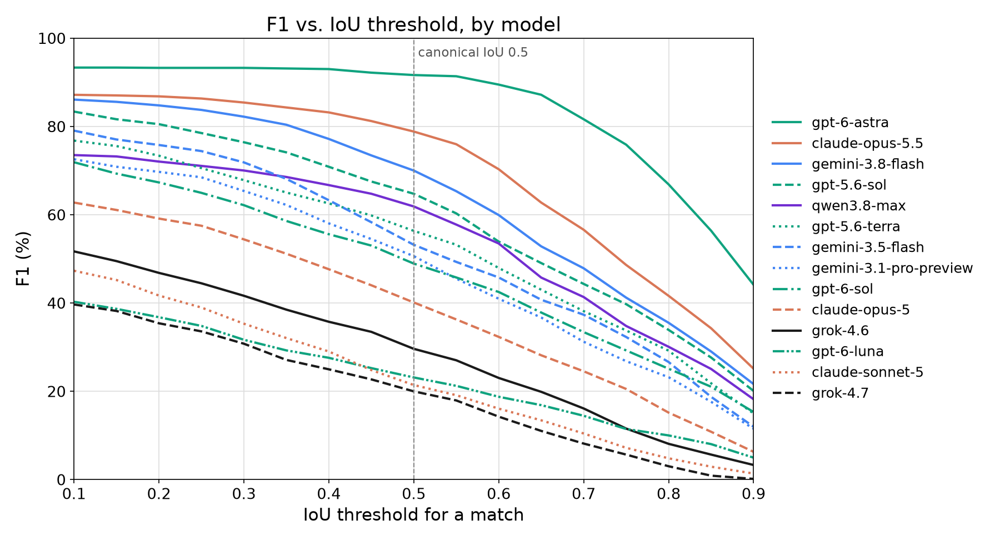
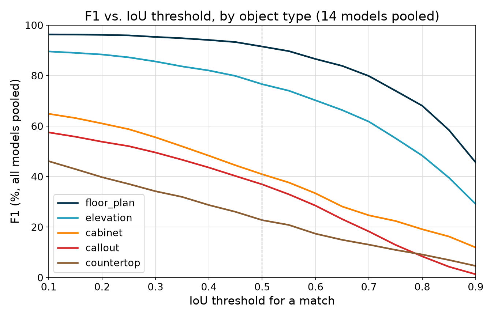
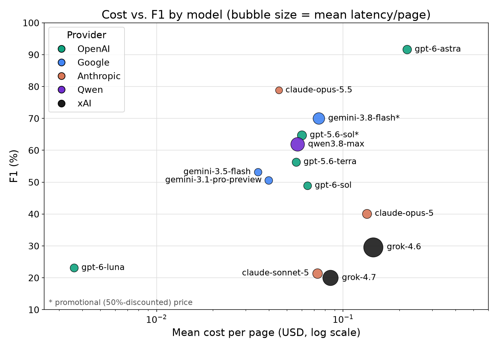
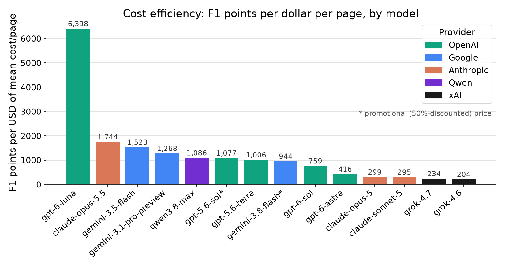

# Single-Pass Vision-Language Model Prompting for Object Localization in Architectural Millwork Drawings

Andrii Chumak, Iryna Mykytyn, Andrian Kozynets, Yurii Didyk, Yelysaveta Mykytyn, Victor Mykhailov, Volodymyr Hresko

COXIT

*VERSION BY 27.09.26*


## Abstract

Architectural millwork and casework drawing sets — cabinet/casework elevations, floor
plans, and reflected ceiling plans — are dense, low-redundancy technical documents that
general-purpose vision-language models (VLMs) receive no domain-specific training for.
We study whether an off-the-shelf, non-fine-tuned VLM can nonetheless localize the
objects on such a sheet from a single instruction prompt and a single full-page image
per request ("One-Stage" detection), and at what accuracy, latency, and dollar cost.
We introduce **CaseV-Bench**, a benchmark built around five object categories —
`elevation`, `floor_plan`, `cabinet`, `countertop`, and `callout` — hand-annotated on
real construction-document PDFs, and evaluate fourteen current VLMs from five providers
(Google, Anthropic, OpenAI, xAI, and Alibaba/Qwen) under one fixed single-pass
prompting protocol, scored by greedy IoU matching against ground truth at IoU ≥ 0.5
with real, provider-reported per-request dollar cost. Across nine annotated sheet sets
(119 pages, 1,430 ground-truth objects), aggregate micro-averaged F1 is **51.0%**,
ranging from **20.0%** to **91.6%** across models — a 4.6× spread wide enough that
model choice dominates prompt design entirely. One model, `gpt-6-astra`, stands apart
from the rest of the field: it is the only model tested that keeps a high F1 (>80%) on
all three small, densely packed object types (`cabinet`, `countertop`, `callout`), but
it is also the most expensive model per page in the evaluation. A second model,
`claude-opus-5.5`, reaches 78.8% F1 at roughly one fifth of that cost and the lowest
latency of any model tested, closing part — but not all — of the small-object gap. An
IoU-threshold sweep (0.10–0.90) shows that the model ranking is stable across
thresholds, and suggests that the small-object gap has two different causes depending
on the model: loosely placed boxes for mid-table models, and objects that go unreported
altogether for the weakest ones. We report per-model, per-document, and per-object-type
results and conclude that single-pass VLM prompting is, for at least one current model,
a plausible unattended first pass for this document class, while remaining an
assisted-review signal for most of the field.

## 1. Introduction

Automating even a first-pass inventory of the casework objects on an architectural
millwork sheet — which elevations exist, which cabinets and countertops they contain,
which plan-view callouts point to which elevation — is a plausible assisted-review task
for a vision-language model. It is also a genuinely hard one: the objects of interest
are small relative to the sheet, densely packed, and drawn with domain-specific
conventions (solid vs. dashed lines, front-view-only annotation rules, section vs.
elevation distinctions) that a model trained on general-purpose imagery has no special
exposure to. Unlike natural-image object detection, there is no large labeled corpus of
architectural millwork drawings to fine-tune against, which makes zero-shot, prompted
detection with a general-purpose VLM the only readily available approach — and raises
the question of how far that approach actually gets.

This paper focuses on the cheapest and most direct way to ask a VLM to do this: send it
one full-page raster image and one instruction prompt per request, and ask it to return
every object of every type it finds, in one pass ("One-Stage" detection, §4). This is
the object of active development in the underlying project because it is the
lowest-cost, lowest-latency configuration by a wide margin, and the central empirical
question is how much of its accuracy gap against a more expensive, multi-pass,
human-in-the-loop alternative can be closed by prompt design and per-model
configuration alone, without changing its one-request-per-page architecture.

Concretely, this paper asks:

1. **How accurately** can a current, general-purpose VLM localize five categories of
   millwork objects from one full-page image and one prompt, with no fine-tuning and no
   task-specific training data?
2. **Does model choice matter more than prompt engineering?** — i.e., given a single,
   carefully iterated prompt held fixed across models, how much does measured accuracy
   vary by model alone?
3. **What does an accurate-enough configuration cost**, in dollars and wall-clock
   latency, per page — using real, provider-billed cost rather than a
   token-count estimate?
4. **What holds single-pass detection back**, structurally — is the bottleneck image
   resolution, prompt specification, or something specific to how a given model reports
   coordinates?

We answer these with a benchmark (§3), a fully specified detection method and prompt
(§4), a fixed evaluation protocol (§5), and results across fourteen models and nine
documents (§6), followed by a discussion of failure modes and limitations (§7–§8).

## 2. Related Work

**Visual grounding with general-purpose VLMs.** Localizing objects by asking a
general-purpose VLM to emit a bounding box — rather than training a dedicated detector
— is an active but still unreliable capability. Recent grounding benchmarks report that
strong general-purpose models are markedly weaker at precise coordinate output than
either specialized grounding models or the same models' own perceptual/reasoning
performance would suggest, with accuracy that degrades further as objects get smaller or
the image gets more cluttered [1, 2]. This matches the central empirical constraint this
paper works within: the object types considered here (`cabinet`, `countertop`
especially) are small and densely packed, precisely the regime where general-purpose VLM
grounding is weakest.

**Symbol and object detection in engineering/architectural drawings.** A separate line
of work treats this as a conventional supervised object-detection problem: YOLO-family
and transformer detectors trained on labeled corpora of engineering or floor-plan
drawings report strong accuracy (mAP@50 in the 80%+ range is typical) on the symbol
classes they are trained for [3, 4]. That accuracy is bought with a labeled training set
specific to the drawing convention and symbol vocabulary in question — an asset this
project does not have, and one that is expensive to build for a narrow, evolving
taxonomy (§3 below describes ours). The approach evaluated in this paper trades that
training cost for a zero-shot general-purpose model, at a currently much lower measured
accuracy (§6); how much of that gap a small amount of task-specific supervision would
close is outside this paper's scope.

**VLM-based document intelligence.** Broader surveys of LLM/VLM use in document
understanding cover layout analysis, OCR-free document QA, and structured extraction
from visually rich documents, and describe zero-shot, single-request-per-page prompting
(as used here) as one point in a design space that also includes retrieval-augmented and
multi-stage pipelines [5, 6]. This paper differs from that broader literature in scope
rather than approach: it evaluates one narrow, densely-annotated document class
(architectural millwork drawings) against real, human-produced ground truth with
IoU-based localization scoring, rather than end-to-end extraction accuracy or QA
correctness.

To the authors' knowledge, no existing benchmark evaluates general-purpose,
non-fine-tuned VLMs specifically on object localization within architectural millwork
drawing sets under a controlled single-pass prompting protocol with provider-billed cost
accounting — the gap this paper's benchmark is built to fill.

## 3. Dataset

### 3.1 Source documents

CaseV-Bench's current evaluation set consists of nine real millwork/casework drawing
sets, submitted as multi-page PDFs. Documents vary substantially in length and object
density — from a 2-page, 48-object set (`prj2`) to a 34-page, 228-object set
(`prj7`) — which is a deliberate property of the dataset, not an artifact: it lets
per-document difficulty (§6.2) separate "hard because dense" from "hard because large."

| Document | Pages | GT objects |
|---|---:|---:|
| `prj1` | 3 | 149 |
| `prj2` | 2 | 48 |
| `prj3` | 7 | 36 |
| `prj4` | 9 | 241 |
| `prj5` | 2 | 80 |
| `prj6` | 24 | 323 |
| `prj7` | 34 | 228 |
| `prj8` | 29 | 231 |
| `prj9` | 9 | 94 |
| **Total** | **119** | **1,430** |

All PDFs are rendered to raster images at request time by the application itself, never
pre-rendered, so every run controls its own DPI and, optionally, a post-render maximum
pixel dimension — the same source PDF can be re-rendered at whatever resolution a given
model needs (§4.3).

### 3.2 Object taxonomy

Ground truth and the detection prompt (§4) target five object types. Definitions below
are condensed from the live detection prompt's own type specifications, which are
themselves derived from a written annotation-rules reference authored by the project's
domain reviewers:

| Label | Definition (condensed) |
|---|---|
| `elevation` | A detailed orthographic view of one object, assembly, or wall, from a single direction — front, back, side, or top. Judged by geometry and scope (one assembly, one direction), not by caption wording. Excludes sections and floor plans. |
| `floor_plan` | A top-down view of a room or overall space — walls, boundaries, and layout seen from above. A top-down view of a single object/assembly is `elevation`, not `floor_plan`; the deciding axis is scope (room vs. single assembly). |
| `cabinet` | One built-in or freestanding storage unit with an enclosed body, annotated only in **front view**. The box covers the cabinet body only — not the countertop/backsplash above it, not the wall or ceiling above a wall cabinet, not adjoining units in the same run. |
| `countertop` | A horizontal work surface on cabinets or on its own legs/brackets, annotated only in **front view**; a backsplash is included in the same box where present. |
| `callout` | A small circular/diamond symbol, with or without a pointer triangle or leader line, referencing a page/elevation/section elsewhere in the set. Explicitly excludes a *view title bubble* — a circle attached to the left end of a view's own underlined title — even when its contents look identical to a real callout; the distinguishing signal is attachment, not content. |

A sixth category, `section` (a wide cross-sectional cutaway), is explicitly **excluded
from annotation**, including any cabinet, countertop, or callout that is visible only
inside one — those are annotated on their own separate front-view elevation instead.
Every box, of every type, is required to be **tight**: each of its four edges touches
the object's own outermost drawn line, with no padding.

By ground-truth object count, the taxonomy is dominated by `callout` (557, 39.0%),
followed by `cabinet` (317, 22.2%) and `elevation` (300, 21.0%), with `floor_plan`
(166, 11.6%) and `countertop` (90, 6.3%) making up the rest. `callout`'s share is
inflated by two outlier-dense documents (`prj4`: 181 of 241 objects; `prj8`: 130 of
231) that contain long runs of plan-view reference symbols; excluding those two
documents, `callout` falls to about a quarter of the remaining objects (246 of 958) and
the label distribution is closer to even across the five types.

### 3.3 Ground-truth format and coordinate convention

Ground-truth boxes are measured in the page's own coordinate space (PDF points at 72 pt
per inch), never in pixels of whatever DPI a given run renders at — normalizing a
ground-truth box against render pixels instead of native point size would silently
shrink every box by a factor of `(dpi / 72)`, large enough at typical rendering DPIs
(180–500) to collapse true-positive counts toward zero while producing no visible error.
Every scoring path derives each page's native point dimensions independently of the DPI
used for a given model call, and normalizes ground truth against that.

### 3.4 Data and code availability

CaseV-Bench is a public benchmark. The evaluation code — including the IoU
greedy-matching scorer used throughout §5–§6 — is public at
[github.com/COXIT-CO/CaseV-bench](https://github.com/COXIT-CO/CaseV-bench/) [7]. That
repository also carries a **subset** of the annotated dataset as a public reference; the
complete nine-document, 1,430-object ground-truth set evaluated in this paper (§3.1) has
not been publicly released.

## 4. Method: One-Stage detection

One-Stage detection is the direct approach: a single request, carrying one full-page
sheet image and one fixed instruction prompt, asks the model to find every object of
every type on that page and report its label and box. No fine-tuning, few-shot examples,
or task-specific training data are used — the prompt is the entire mechanism by which
the model is told what to look for and how to report it. This section specifies that
prompt structurally; its full text is reproduced verbatim in Appendix A.

### 4.1 Task framing

The prompt opens by naming the document class explicitly (an AEC drawing sheet that may
hold several drawing views at very different scales — a floor plan or elevation filling
a quadrant of the sheet, a callout a tiny symbol within it) and states the task as
**multi-class localization**: find and box every instance of the five types in §3.2,
tag each with its label, and report large regions and small symbols side by side in the
same pass. Boxes of different types are explicitly permitted to overlap — a cabinet sits
inside its elevation, a callout sits inside a floor plan — and the model is told this is
expected, not an error to resolve by merging or dropping one of the two.

### 4.2 Disambiguation rules

Beyond the five per-type definitions (§3.2), the prompt carries rules aimed
specifically at cases the underlying reference distinguishes but a generic reading of
the definitions would not catch:

- **`floor_plan` vs. `elevation`** is scoped by *what the view covers*, not by view
  direction: a top-down view of a whole room is `floor_plan`; a top-down view of one
  object or assembly is still `elevation`. A same-direction view can land on either side
  of that line depending on scope alone.
- **`section` is out of scope entirely**, and so is anything drawn only inside one — a
  cabinet, countertop, or callout visible solely within a cross-sectional cutaway is not
  annotated there; it is expected to also appear on its own separate front-view
  elevation elsewhere on the sheet, which is where it is annotated instead.
- **`callout` vs. view title bubble** is the prompt's most detailed disambiguation rule,
  because the two can be textually identical: a callout and a title bubble can both read
  as a bare number or a number over a sheet ID. The prompt states explicitly that content
  does not decide — *attachment* does. A circle fused to the left end of a view's own
  underlined title is a title bubble, never a callout, regardless of what is written
  inside it.
- **Cabinet/countertop box edges are defined operationally, not just by object
  identity.** For a base cabinet, the box's top edge is the line directly under the
  countertop — the countertop and any backsplash are explicitly excluded from the
  cabinet's own box. For a wall cabinet, the top edge is the cabinet's own top line, never
  the wall or ceiling area above it. The prompt gives a standing self-check: before
  emitting a box, verify that the region between its top edge and the object's own top
  line contains nothing that belongs to a different object; if it does, shrink the box.

### 4.3 Coordinate and output contract

Coordinates are requested as **normalized fractions in [0, 1]** of the image actually
sent, independently on each axis, origin at the top-left corner — i.e. a plain
`x_min/y_min/x_max/y_max` fraction, not a 0–1000 integer scale or a pixel coordinate.
Each detection is one JSON object of the shape:

```json
{"label": "cabinet",
 "bounding_box": {"x_min": 0.12, "y_min": 0.34, "x_max": 0.20, "y_max": 0.41}}
```

with `label` constrained to exactly one of the five taxonomy strings (§3.2; `floor_plan`
spelled with an underscore) and the model instructed to return a bare JSON array of such
objects — no prose, no markdown code fences, and an explicit empty array `[]` when a
page contains none of the five types. No count or summary field is requested; consistent
with the rest of the project's detection methods, object counts are treated as something
to be recomputed from the final object list rather than trusted from the model.

### 4.4 Execution pipeline

The results reported in §6 were produced by a separate execution harness from the one
described in the project's internal engineering documentation for earlier prompt
iterations; this paper reports the prompt itself (§4.1–§4.3, Appendix A) and the
resulting scored detections (§5–§6) with confidence, since both are recoverable directly
from the shared results table each run was written to. The harness's own execution
parameters — rendering DPI, request granularity (per page vs. per document), and
retry/repair behavior for malformed model output — are not independently documented as
of this draft and are called out explicitly in §7 as an open item rather than assumed
from other parts of the project.

## 5. Evaluation protocol

### 5.1 Matching and metrics

Scoring is performed by a shared internal package, `location-scorer` (version
`v0.1.0`, identical across every run reported in this paper), so that a difference in
measured accuracy reflects the detection approach and model, not a difference in how it
was scored. For each page, predicted and ground-truth boxes are bucketed by `(page,
object_type)` and matched greedily by IoU; a match counts as a true positive at or above
a fixed **IoU threshold of 0.5**, with unmatched predictions counted as false positives
and unmatched ground-truth objects as false negatives.

Precision, recall, and F1 are reported as **aggregate ("overall") metrics** — true
positives, false positives, and false negatives summed across every document first, then
divided once (micro-averaged), not averaged per-document. This is a deliberate choice:
under a per-document average, a small, easy-to-perfect document would count equally with
a large, hard one, which is not the summary statistic of interest for a
deployment-oriented question ("how many objects, in total, does this configuration find
correctly"). Per-object-type and per-page breakdowns are computed by the same scorer and
retained per run, but are not used as the headline number in §6 for the same reason.

IoU 0.5 is the canonical operating point, and every headline number in §6 is reported
there. In addition, every run is re-scored across a sweep of IoU thresholds from 0.10 to
0.90 in steps of 0.05, with the same matching rule at each step. The sweep serves two
purposes in §6.4. First, it tests whether the model ranking depends on the choice of
0.5. Second, it helps separate two failure modes that a single F1 number collapses into
one: "the box is loose but roughly in the right place" (a miss at 0.5 that becomes a
match at a lenient threshold such as 0.10) and "the object was not reported at all" (a
miss at every threshold). Because matching is best-IoU-first, lowering the threshold
only appends lower-IoU pairs to the matches already found at a stricter one; the number
of true positives at each threshold is therefore the cumulative distribution of matched
IoU values, which also gives an estimate of each model's mean IoU of matches (§6.4).

### 5.2 Cost and latency instrumentation

Every scored run in this paper carries the **actual dollar cost charged for that
specific request**, as reported by the model provider through OpenRouter's per-request
usage accounting, rather than an estimate computed from a locally maintained token-price
table. This keeps reported cost correct as provider pricing changes and comparable across
models and providers without this paper needing to track pricing itself. Wall-clock
latency is recorded per run alongside cost. Both are reported per processed page, as a
mean (total cost or time over all 119 pages divided by 119) and as a median; since pages
range from a single object to more than sixty, the mean is pulled upward by the densest
pages and the median is closer to what a typical page costs. Two models were billed at a
promotional rate during the evaluation window (§6.5); their costs are reported as billed
and flagged wherever they appear. A scoring failure (e.g. no ground truth
available for a document) is isolated from the detection result itself and does not
appear in the tables in §6.

## 6. Results

All results below are for the current, best-performing One-Stage prompt (§4, Appendix
A), evaluated on all nine documents (§3.1, 119 pages, 1,430 ground-truth objects) with
fourteen models from five providers. Where a (model, document) pair was run more than
once, the most recent run is used (§6.6 notes this as a scope decision, not a hidden
average). Aggregate metrics are micro-averaged (§5.1): true positives, false positives,
and false negatives are summed across all documents before precision/recall/F1 are
computed once, so one large document does not get outweighed by several small ones.
Unless stated otherwise, every number is at the canonical IoU threshold of 0.5; §6.4
reports how the picture changes at other thresholds.

### 6.1 Headline — accuracy by model

| Model | Provider | TP | FP | FN | Precision | Recall | **F1** | Mean cost/page | Mean latency/page |
|---|---|---:|---:|---:|---:|---:|---:|---:|---:|
| `gpt-6-astra` | OpenAI | 1,354 | 171 | 76 | 88.8% | 94.7% | **91.6%** | $0.220 | 39.3 s |
| `claude-opus-5.5` | Anthropic | 1,127 | 302 | 303 | 78.9% | 78.8% | **78.8%** | $0.045 | 11.3 s |
| `gemini-3.8-flash` | Google | 958 | 349 | 472 | 73.3% | 67.0% | **70.0%** | $0.074\* | 104.3 s |
| `gpt-5.6-sol` | OpenAI | 932 | 517 | 498 | 64.3% | 65.2% | **64.7%** | $0.060\* | 48.7 s |
| `qwen3.8-max` | Qwen | 1,010 | 825 | 420 | 55.0% | 70.6% | **61.9%** | $0.057 | 161.2 s |
| `gpt-5.6-terra` | OpenAI | 824 | 671 | 606 | 55.1% | 57.6% | **56.3%** | $0.056 | 32.5 s |
| `gemini-3.5-flash` | Google | 769 | 693 | 661 | 52.6% | 53.8% | **53.2%** | $0.035 | 19.8 s |
| `gemini-3.1-pro-preview` | Google | 655 | 503 | 775 | 56.6% | 45.8% | **50.6%** | $0.040 | 23.0 s |
| `gpt-6-sol` | OpenAI | 684 | 682 | 746 | 50.1% | 47.8% | **48.9%** | $0.065 | 25.6 s |
| `claude-opus-5` | Anthropic | 741 | 1,523 | 689 | 32.7% | 51.8% | **40.1%** | $0.134 | 48.3 s |
| `grok-4.6` | xAI | 377 | 739 | 1,053 | 33.8% | 26.4% | **29.6%** | $0.145 | 362.3 s |
| `gpt-6-luna` | OpenAI | 317 | 994 | 1,113 | 24.2% | 22.2% | **23.1%** | $0.004 | 29.4 s |
| `claude-sonnet-5` | Anthropic | 316 | 1,205 | 1,114 | 20.8% | 22.1% | **21.4%** | $0.073 | 60.2 s |
| `grok-4.7` | xAI | 272 | 1,021 | 1,158 | 21.0% | 19.0% | **20.0%** | $0.085 | 215.9 s |
| **All models pooled** | — | 10,336 | 10,195 | 9,684 | 50.3% | 51.6% | **51.0%** | — | — |

\* Billed at a 50% promotional discount, not the provider's standard rate (§6.5).



Four things stand out. **One model, `gpt-6-astra`, is in a different regime from every
other model tested**: 91.6% F1, 12.8 points clear of the next-best model
(`claude-opus-5.5`, 78.8%) and more than 20 points clear of every other model in the
field. Second, **the overall spread across all fourteen models is wide** — 20.0% to
91.6% F1, a **4.6× range** — for the *same* prompt, the *same* documents, and the
*same* IoU threshold; model choice is not just a consequential lever on accuracy, it
appears to be the dominant one. Third, **the ranking does not track provider or
"flagship" status cleanly**: the five OpenAI models span 68.5 F1 points among
themselves (`gpt-6-astra` 91.6% to `gpt-6-luna` 23.1%), and the three Anthropic models
span 57.4 points (`claude-opus-5.5` 78.8% to `claude-sonnet-5` 21.4%). Fourth,
**judging by version numbers, a newer model is not reliably a better one on this task**:
`claude-opus-5.5` improves on `claude-opus-5` by 38.7 points, but `grok-4.7` scores 9.6 points below `grok-4.6`,
and `gpt-6-sol` scores 15.8 points below `gpt-5.6-sol`. Recall varies somewhat more
across models than precision does (19.0–94.7%, a 76-point range, vs. 20.8–88.8%, a
68-point range) — `gpt-6-astra`'s lead is driven by being strong on *both* axes at
once, not by trading one for the other.

### 6.2 Per-document difficulty

| Document | Pages | GT objects | F1 (all models pooled) |
|---|---:|---:|---:|
| `prj1` | 3 | 149 | 37.9% |
| `prj2` | 2 | 48 | 47.4% |
| `prj3` | 7 | 36 | 63.5% |
| `prj4` | 9 | 241 | 54.7% |
| `prj5` | 2 | 80 | **72.9%** |
| `prj6` | 24 | 323 | 41.0% |
| `prj7` | 34 | 228 | 50.8% |
| `prj8` | 29 | 231 | 61.1% |
| `prj9` | 9 | 94 | 49.9% |



`prj5` (2 pages) is the easiest document (72.9%) and `prj1` (3 pages) is the hardest
(37.9%) — both among the three shortest documents in the set, in either direction.
`prj1` is also the densest document by far (149 objects on 3 pages, 87 of them
callouts). The three longest documents span much of the range rather than clustering
together: `prj8` (29 pages) is the third-best result (61.1%), `prj7` (34 pages) sits
near the median (50.8%), and `prj6` (24 pages) is the second-worst (41.0%). Object
*density* and *type mix* (§6.3) appear to matter more for this configuration than page
count or raw object count per se; a per-document, per-model breakdown is left for
future work.

### 6.3 Accuracy by object type

| Type | TP | FP | FN | Precision | Recall | **F1** |
|---|---:|---:|---:|---:|---:|---:|
| `floor_plan` | 2,114 | 182 | 210 | 92.1% | 91.0% | **91.5%** |
| `elevation` | 3,050 | 713 | 1,150 | 81.1% | 72.6% | **76.6%** |
| `cabinet` | 1,785 | 2,504 | 2,653 | 41.6% | 40.2% | **40.9%** |
| `callout` | 3,125 | 6,013 | 4,673 | 34.2% | 40.1% | **36.9%** |
| `countertop` | 262 | 783 | 998 | 25.1% | 20.8% | **22.7%** |



The two large, sheet-level region types (`floor_plan`, `elevation`) score far higher
(76.6–91.5% F1) than the three small/dense object types (`cabinet`, `callout`,
`countertop`, 22.7–40.9% F1) — roughly a 2–4× gap (91.5/22.7 ≈ 4.0×), though the pooled
small-object numbers are pulled up by two models (`gpt-6-astra` and, to a lesser
extent, `claude-opus-5.5`) that show this pattern much more weakly or not at all (see
below). This is the pattern the visual-grounding literature reports for general-purpose
VLMs more broadly (§2) — accuracy degrades as objects get smaller relative to the image
and more densely packed — but the per-model breakdown shows it is not universal.

Per-model, the picture is stark:



| Model | `elevation` | `floor_plan` | `cabinet` | `countertop` | `callout` |
|---|---:|---:|---:|---:|---:|
| `gpt-6-astra` | **93.8%** | **98.8%** | **81.8%** | **83.6%** | **95.6%** |
| `claude-opus-5.5` | 89.8% | 90.9% | 60.1% | 51.2% | 84.1% |
| `gemini-3.8-flash` | 86.1% | 96.7% | 58.8% | 19.8% | 67.5% |
| `gpt-5.6-sol` | 87.9% | 98.2% | 52.6% | 24.2% | 56.6% |
| `qwen3.8-max` | 90.4% | 97.9% | 60.3% | 32.4% | 47.4% |
| `gpt-5.6-terra` | 86.9% | 93.9% | 51.3% | 23.5% | 38.3% |
| `gemini-3.5-flash` | 89.6% | 96.4% | 45.3% | 16.5% | 32.9% |
| `gemini-3.1-pro-preview` | 78.2% | 89.0% | 39.0% | 9.7% | 37.3% |
| `gpt-6-sol` | 83.2% | 96.3% | 25.3% | 11.4% | 36.4% |
| `claude-opus-5` | 88.7% | 95.5% | 51.2% | 18.8% | 14.6% |
| `grok-4.6` | 68.7% | 91.4% | 5.4% | 7.4% | 0.5% |
| `gpt-6-luna` | 38.1% | 81.7% | 13.2% | 8.3% | 6.1% |
| `claude-sonnet-5` | 47.3% | 73.0% | 9.7% | 0.0% | 4.4% |
| `grok-4.7` | 44.1% | 81.1% | 3.4% | 0.0% | 0.2% |

`gpt-6-astra` is the single best model on every one of the five types, and unlike every
other model in the set, it does not show the large-vs-small gap: it is the only model
above 80% F1 on all three small types (81.8–95.6%). `claude-opus-5.5` narrows the gap
without closing it — it is second on `countertop` and `callout` and a close third on
`cabinet` (60.1%, vs. 60.3% for `qwen3.8-max`), and its
`callout` score (84.1%) is within 12 points of `gpt-6-astra`'s, but its `countertop`
score (51.2%) is still 32 points behind. Every other model scores at most 67.5% on any
small type, and at most 32.4% on `countertop`. The large-vs-small object gap, which one
might otherwise read as a structural property of single-pass VLM prompting on this
document class, therefore looks more like a property of most current models than of the
task itself. At the other end, `grok-4.6`, `grok-4.7`, `gpt-6-luna`, and
`claude-sonnet-5` are the clearest examples of the conventional pattern: all four score
far higher on `floor_plan` (73.0–91.4% F1) than on any small object type, and all four
collapse on small objects specifically (`cabinet` 3.4–13.2%, `countertop` 0.0–8.3%,
`callout` 0.2–6.1%). §6.4 examines whether that gap is a placement-precision problem or
a detection problem, and finds that the answer differs between the middle and the
bottom of the table.

### 6.4 Sensitivity to the IoU threshold: placement vs. detection

The canonical threshold of 0.5 asks for a box that is both on the right object and
reasonably tight. Re-scoring every run across IoU thresholds from 0.10 to 0.90 (§5.1)
separates the two requirements: at 0.10 almost any box that overlaps the right object
counts, so F1 there approximates *whether the object was found*; the drop from 0.10 to
0.50 and beyond measures *how precisely it was boxed*.



| Model | F1 @ 0.10 | F1 @ 0.30 | **F1 @ 0.50** | F1 @ 0.75 | F1 @ 0.90 | Mean IoU of matches (est.) |
|---|---:|---:|---:|---:|---:|---:|
| `gpt-6-astra` | 93.3% | 93.3% | **91.6%** | 75.9% | 44.1% | 0.86 |
| `claude-opus-5.5` | 87.2% | 85.4% | **78.8%** | 48.6% | 25.1% | 0.80 |
| `gemini-3.8-flash` | 86.1% | 82.2% | **70.0%** | 41.2% | 21.6% | 0.79 |
| `gpt-5.6-sol` | 83.4% | 76.4% | **64.7%** | 39.7% | 20.1% | 0.79 |
| `qwen3.8-max` | 73.5% | 70.0% | **61.9%** | 34.8% | 18.2% | 0.78 |
| `gpt-5.6-terra` | 76.8% | 67.8% | **56.3%** | 33.8% | 15.0% | 0.78 |
| `gemini-3.5-flash` | 79.0% | 71.9% | **53.2%** | 32.3% | 12.0% | 0.78 |
| `gemini-3.1-pro-preview` | 72.6% | 65.4% | **50.6%** | 26.8% | 11.5% | 0.76 |
| `gpt-6-sol` | 71.9% | 62.2% | **48.9%** | 29.3% | 15.3% | 0.79 |
| `claude-opus-5` | 62.8% | 54.4% | **40.1%** | 20.5% | 6.3% | 0.75 |
| `grok-4.6` | 51.7% | 41.6% | **29.6%** | 11.5% | 3.3% | 0.72 |
| `gpt-6-luna` | 40.3% | 31.7% | **23.1%** | 11.5% | 5.0% | 0.76 |
| `claude-sonnet-5` | 47.3% | 35.3% | **21.4%** | 7.2% | 1.4% | 0.70 |
| `grok-4.7` | 39.7% | 30.8% | **20.0%** | 5.7% | 0.1% | 0.68 |

*Mean IoU of matches* is the mean IoU of true-positive matches at IoU ≥ 0.5, estimated
from the threshold sweep by assigning each match to the midpoint of its 0.05-wide IoU
bin (0.95 for the top bin); the estimate is accurate to within ±0.025 by construction.

**The ranking does not depend on the choice of 0.5.** The Spearman rank correlation
between the model ranking at 0.5 and the ranking at any other threshold in the sweep
never falls below 0.96 (its minimum, 0.969, is at IoU 0.90), and the top four models
(`gpt-6-astra`, `claude-opus-5.5`, `gemini-3.8-flash`, `gpt-5.6-sol`) are the same, in
the same order, at every threshold from 0.10 to 0.90. Absolute numbers, however, depend
heavily on the threshold: pooled over all models, F1 is 69.1% at IoU 0.10, 51.0% at
0.50, 30.1% at 0.75, and 14.3% at 0.90.

**`gpt-6-astra` places boxes measurably tighter than every other model.** Its F1 is
essentially flat from 0.10 to 0.50 (93.3% → 91.6%) and it still scores 75.9% at 0.75,
where no other model exceeds 48.6%. Its estimated mean IoU of matches (0.86) is clearly
apart from the rest of the field (0.68–0.80). `claude-opus-5.5` loses more between 0.10
and 0.50 (87.2% → 78.8%) and falls faster above 0.5, so its gap to `gpt-6-astra` is
partly a detection gap and partly a box-precision gap.



| Type (all models pooled) | F1 @ 0.10 | **F1 @ 0.50** | F1 @ 0.75 |
|---|---:|---:|---:|
| `floor_plan` | 96.3% | **91.5%** | 74.0% |
| `elevation` | 89.6% | **76.6%** | 55.2% |
| `cabinet` | 64.9% | **40.9%** | 22.4% |
| `callout` | 57.5% | **36.9%** | 12.9% |
| `countertop` | 46.1% | **22.7%** | 10.9% |

By object type, the small types lose far more of their score to box precision than the
large ones do: between IoU 0.10 and 0.50, pooled `floor_plan` F1 drops by 5 points,
while `cabinet`, `callout`, and `countertop` each drop by roughly 21–24 points.
`callout` is the most sensitive type at strict thresholds (12.9% at 0.75, 1.3% at
0.90), which is plausible for a tiny symbol: a box offset of a few pixels is a small
fraction of an elevation's size but a large fraction of a callout's.

| Model | Small-type recall @ 0.10 | Small-type recall @ 0.50 | Large-type F1 @ 0.10 | Large-type F1 @ 0.50 |
|---|---:|---:|---:|---:|
| `gpt-6-astra` | 97.1% | 94.9% | 96.5% | 95.6% |
| `claude-opus-5.5` | 87.0% | 75.6% | 92.2% | 90.1% |
| `gemini-3.8-flash` | 80.1% | 58.1% | 91.9% | 90.0% |
| `gpt-5.6-sol` | 80.6% | 53.9% | 94.2% | 91.8% |
| `qwen3.8-max` | 78.4% | 60.4% | 96.6% | 93.1% |
| `gpt-5.6-terra` | 71.8% | 43.2% | 94.4% | 89.4% |
| `gemini-3.5-flash` | 74.2% | 36.5% | 94.6% | 92.2% |
| `gemini-3.1-pro-preview` | 60.1% | 32.4% | 86.4% | 82.4% |
| `gpt-6-sol` | 60.9% | 30.2% | 93.6% | 88.0% |
| `claude-opus-5` | 74.7% | 33.8% | 96.5% | 91.2% |
| `grok-4.6` | 22.9% | 2.5% | 95.4% | 77.1% |
| `gpt-6-luna` | 20.4% | 8.0% | 79.8% | 53.9% |
| `claude-sonnet-5` | 30.7% | 5.9% | 88.2% | 56.8% |
| `grok-4.7` | 14.7% | 1.1% | 87.6% | 57.4% |

"Small types" pools `cabinet`, `countertop`, and `callout`; "large types" pools
`floor_plan` and `elevation`.

Splitting by model suggests that the small-object gap has different causes in
different parts of the table:

- **Mid-table models mostly find small objects but box them loosely.** For
  `claude-opus-5`, `gemini-3.5-flash`, `gpt-6-sol`, `gpt-5.6-terra`, and
  `gemini-3.1-pro-preview`, small-type recall falls by 28–41 points between IoU 0.10
  and 0.50 (e.g. `claude-opus-5`: 74.7% → 33.8%; `gemini-3.5-flash`: 74.2% → 36.5%).
  For these models, roughly 40–60% of the small objects that go unmatched at 0.5 appear
  to have been reported near the right place, but not tightly enough to count. Their
  large-type F1 changes little over the same range (at most 5.6 points), so the loss
  is specific to small objects.
- **The weakest models mostly do not report small objects at all.** For `grok-4.6`,
  `grok-4.7`, `gpt-6-luna`, and `claude-sonnet-5`, small-type recall stays at or below
  31% even at IoU 0.10, so most small objects are missed at any threshold. These four
  are also the only models whose *large*-type F1 drops sharply between 0.10 and 0.50
  (by 18–31 points), so their boxes are loose across the board, not just on small
  objects. `claude-sonnet-5` illustrates both effects: it has no true-positive
  `countertop` match at IoU 0.5 (0.0% F1), but reaches 22.5% `countertop` F1 at 0.10 —
  it does report some countertops, just never tightly enough.
- **`gpt-6-astra` shows neither effect**: 97.1% of small objects are found at IoU
  0.10, and 94.9% are still matched at 0.50.

One caveat applies to the lenient end of the sweep: on a dense run of cabinets or
callouts, a loose box can overlap a *neighbouring* object by 10% and be matched to it.
Recall at IoU 0.10 is therefore best read as an upper bound on how many small objects a
model actually located, and the split above as indicative rather than exact. Why
small-object detection and placement degrade for most models — a genuine perception
limit vs. a prompt-following one — is not resolved by this data and is noted as an open
question in §7.

### 6.5 Cost, latency, and cost-efficiency

| Model | F1 | Mean cost/page | Median cost/page | Mean latency/page | Median latency/page | F1 pts per $/page |
|---|---:|---:|---:|---:|---:|---:|
| `gpt-6-astra` | 91.6% | $0.220 | $0.186 | 39.3 s | 28.2 s | 416 |
| `claude-opus-5.5` | 78.8% | $0.045 | $0.040 | 11.3 s | 8.9 s | 1,744 |
| `gemini-3.8-flash` | 70.0% | $0.074\* | $0.071\* | 104.3 s | 100.1 s | 944\* |
| `gpt-5.6-sol` | 64.7% | $0.060\* | $0.057\* | 48.7 s | 45.2 s | 1,077\* |
| `qwen3.8-max` | 61.9% | $0.057 | $0.055 | 161.2 s | 154.9 s | 1,086 |
| `gpt-5.6-terra` | 56.3% | $0.056 | $0.056 | 32.5 s | 32.0 s | 1,006 |
| `gemini-3.5-flash` | 53.2% | $0.035 | $0.026 | 19.8 s | 15.5 s | 1,523 |
| `gemini-3.1-pro-preview` | 50.6% | $0.040 | $0.033 | 23.0 s | 19.2 s | 1,268 |
| `gpt-6-sol` | 48.9% | $0.065 | $0.068 | 25.6 s | 24.3 s | 759 |
| `claude-opus-5` | 40.1% | $0.134 | $0.112 | 48.3 s | 37.2 s | 299 |
| `grok-4.6` | 29.6% | $0.145 | $0.134 | 362.3 s | 331.9 s | 204 |
| `gpt-6-luna` | 23.1% | $0.004 | $0.004 | 29.4 s | 29.5 s | 6,398 |
| `claude-sonnet-5` | 21.4% | $0.073 | $0.072 | 60.2 s | 60.8 s | 295 |
| `grok-4.7` | 20.0% | $0.085 | $0.078 | 215.9 s | 185.9 s | 234 |

\* Billed at a 50% promotional discount, not the provider's standard rate; at standard
rates these costs would be roughly twice as high, and the cost-efficiency figures
roughly half.



Cost and accuracy are not cleanly aligned across the fourteen models. `gpt-6-astra` is
simultaneously the **most accurate and the most expensive model per page** in the
evaluation ($0.220/page mean, $26.21 for all 119 pages; the next-highest are
`grok-4.6` at $0.145 and `claude-opus-5` at $0.134). `claude-opus-5.5` changes the
shape of the trade-off: it is the second most accurate model (78.8% F1), among the
cheapest ($0.045/page, about one fifth of `gpt-6-astra`'s cost, $5.38 for the full
set), and the fastest model tested by a wide margin (11.3 s/page mean, 8.9 s median,
about 3.5× faster than `gpt-6-astra`). The practical choice at the top of the table is
therefore between `gpt-6-astra`'s additional 12.8 F1 points — concentrated on
`cabinet` and `countertop` (§6.3) — and `claude-opus-5.5`'s much lower cost and
latency. Below those two, low cost does not predict low accuracy or vice versa: the
cheapest model, `gpt-6-luna` ($0.004/page, $0.43 for the whole set), is also
near the bottom on F1 (23.1%); `claude-sonnet-5` and `grok-4.7` are mid-priced and the
two least accurate models; and `grok-4.6` is expensive, the slowest model in the
evaluation (362.3 s/page mean — 1.7× the next-slowest, `grok-4.7`, and 32× the
fastest), and fourth-worst on F1. Latency varies more than cost overall: the four
slowest models (`grok-4.6`, `grok-4.7`, `qwen3.8-max`, `gemini-3.8-flash`) all take
more than 100 s per page, while nine of the fourteen take under 50 s.

For most models the mean cost per page is somewhat above the median (e.g.
`gemini-3.5-flash` $0.035 vs. $0.026, `gpt-6-astra` $0.220 vs. $0.186), consistent with
a minority of dense pages costing noticeably more than a typical one. Budgeting for a
whole drawing set should use the mean; estimating a typical single page, the median.



A cost-efficiency view — F1 points per dollar of mean cost per page — ranks the models
differently again. `claude-opus-5.5` (1,744) is the most cost-efficient model that is
also accurate; `gemini-3.5-flash` (1,523) and `gemini-3.1-pro-preview` (1,268) follow.
`gpt-6-luna` tops this measure (6,398) only because its cost is near zero — at 23.1% F1
it is not a usable configuration for this task, which illustrates that a ratio metric
rewards very cheap, weak models and should be read together with raw accuracy.
`gpt-6-astra` ranks **10th of 14** (416), ahead only of `claude-opus-5`,
`claude-sonnet-5`, and the two Grok models. Whether `gpt-6-astra`'s accuracy is worth
its cost premium is therefore a deployment-specific question this paper does not
resolve: for a use case where missing a small `cabinet` or `countertop` is costly,
`gpt-6-astra`'s lead on exactly those types (§6.3) may justify roughly 5× the per-page
cost of `claude-opus-5.5`; for a use case that can tolerate a moderate small-object
gap, `claude-opus-5.5` is a materially cheaper and faster choice.

### 6.6 Scope notes

Four caveats on how these numbers were produced, stated explicitly since they affect
how much weight to put on small differences:

- **One run per (model, document) pair**, taken as the most recent when a pair was run
  more than once; no repeated-trial variance estimate is available from this data.
  Differences of a few F1 points between two models should not be read as
  statistically distinguished from noise; the differences this section leads with (the
  4.6× model spread in §6.1, `gpt-6-astra`'s absence of a large-vs-small gap in §6.3,
  and the 12.8-point lead of `gpt-6-astra` over `claude-opus-5.5`) are much larger than
  that.
- **Coverage across (model, document) pairs was not perfectly uniform** in the
  underlying run history — some pairs were run more than once before the most-recent-run
  rule above was applied, for reasons not recorded in the data available for this draft.
  Every model was ultimately evaluated on all nine documents (all 119 pages), so the
  headline numbers in §6.1 are not affected by missing cells.
- **Two models were billed at a promotional rate.** Costs for `gpt-5.6-sol` and
  `gemini-3.8-flash` reflect a 50% promotional discount in effect during the evaluation,
  not standard pricing. They are reported as billed, since that is what the runs
  actually cost, and flagged wherever they appear; at standard rates both would sit
  closer to `claude-opus-5` on cost per page, and their cost-efficiency would roughly
  halve.
- **Results attributed to a separate, sliding-window detection method (a different
  author's exploratory run, tagged `sliding_window` in the underlying run history) are
  excluded from this paper entirely.** That method uses a materially different request
  granularity than the One-Stage protocol specified in §4 and was run on a single
  document with an earlier taxonomy version, so it is not comparable to the results
  above and is left out rather than mixed in; it is discussed qualitatively as future
  work in §8.

## 7. Limitations

**Why `gpt-6-astra` avoids the small-object failure mode that most other models show is
not explained by this data.** §6.3 shows that one model spans the large-vs-small object
gap that most of the field shows; §6.4 shows it also places boxes more tightly overall
(estimated mean IoU of matches 0.86 vs. 0.68–0.80 for the rest of the field) and finds
nearly all small objects even at a lenient threshold. This evaluation cannot say *why*:
candidate explanations include a materially higher effective image resolution reaching
the model's vision encoder, a different (and more literal) adherence to the
box-tightness and small-object instructions in the shared prompt (§4.2, Appendix A), or
an architectural difference unrelated to either. The same question applies, to a lesser
degree, to `claude-opus-5.5`, which narrows the gap substantially at a much lower cost.
Distinguishing these explanations would need a controlled resolution sweep and a prompt
ablation run specifically against these models, neither of which this evaluation ran.

**The small-object failure mode in the other models is characterized but not
explained.** §6.4 suggests that for mid-table models the small-object gap is largely a
*placement* failure (the object is reported, but the box is too loose to reach IoU 0.5),
while for the weakest models it is largely a *detection* failure (the object goes
unreported even at IoU 0.10). That split rests on recall at a lenient threshold, which
can overstate how many objects were really found in dense runs (§6.4). Nor can this data
distinguish between the two most likely underlying causes: a genuine perception limit
(the model's vision encoder discards small-object detail before the language model ever
reasons about it, e.g. through aggressive internal image downsampling) and a
prompt-following limit (the model perceives the object well enough but under-reports or
loosely boxes it for reasons specific to how the instructions are phrased or how much of
a long, dense list it is willing to emit). Distinguishing these would need either a
controlled resolution sweep per model or a targeted prompt ablation, neither of which
this evaluation ran.

**The execution harness that produced §6's results is not independently documented.**
As noted in §4.4, the prompt itself (Appendix A) and the scored outcomes (§6) are known
directly from the shared results this paper draws on, but the harness's own rendering
DPI, request granularity (whether a whole document or one page is sent per request), and
malformed-output retry behavior are not. Because §6.4 suggests that small-object errors
are partly a matter of box precision and, for the weakest models, of recall — and image
resolution is one of the more likely causes of both — not knowing the rendering DPI used
per model is a real gap: a low-DPI render could produce much of the pattern observed even
for a model that would do much better at a higher one. This paper reports what is
measured and flags what is not, rather than assuming values from unrelated parts of the
project.

**Ground truth reflects human judgment calls that are not independently verified for
agreement.** The taxonomy's most detailed disambiguation rules — `callout` vs. a view
title bubble decided by attachment rather than content, `cabinet`/`countertop` box edges
that must exclude an adjacent object even when densely packed (§4.2) — require real
judgment to annotate consistently. No second annotator pass or inter-annotator agreement
figure is reported alongside the ground truth used in §6, so some fraction of what this
evaluation scores as a false positive or false negative may reflect an ambiguous case
rather than a clear model error. This affects the absolute accuracy numbers more than
the cross-model comparison, since every model is scored against the same ground truth.

**Results come from a single run per configuration, without statistical testing.** §6.6
already states the run-repetition caveat. The IoU-threshold choice, by contrast, has
been checked (§6.4): the model ranking is essentially unchanged from IoU 0.10 to 0.90,
although absolute F1 values depend strongly on the threshold, so the headline numbers
should always be read together with the 0.5 operating point they were measured at. No
statistical test accompanies any comparison in this paper — the differences led with in
§6 (a 4.6× model spread, `gpt-6-astra`'s absence of a large-vs-small gap) are treated as
larger than plausible run-to-run noise rather than formally tested as such.

**No fine-tuned or task-specific baseline is included.** §2 notes that supervised
detectors trained on labeled engineering-drawing corpora report substantially higher
accuracy than what is measured here for zero-shot VLM prompting. This paper does not
attempt to quantify that gap directly — CaseV-Bench's five-type taxonomy has no
comparably-sized labeled training set to fine-tune against — so the numbers in §6 should
be read as a zero-shot ceiling for this exact prompting approach, not as a statement
about what is achievable for this document class with any amount of supervision.

## 8. Conclusion and Future Work

Returning to the four questions posed in §1:

1. **How accurately can a current, general-purpose VLM localize these objects?**
   Aggregate F1 is 51.0% pooled across fourteen models, but that pooled number obscures
   the real finding: the best single model (`gpt-6-astra`) reaches 91.6% F1, and unlike
   every other model tested, it stays high on the three small/dense types (81.8–95.6%
   F1) as well as the two large region types (93.8–98.8% F1). For that one model,
   single-pass VLM prompting looks like a plausible unattended first pass on this
   document class, not just an assisted-review signal. `claude-opus-5.5` (78.8%) comes
   closest, with strong `callout` detection (84.1%) but weaker `cabinet` and
   `countertop` scores (51–60%). For the remaining twelve models — the best of which is
   `gemini-3.8-flash` at 70.0% — the pattern is different: mostly strong enough on
   `floor_plan` and `elevation` to be a useful first pass (up to 98.2% F1), but too weak
   on `cabinet`, `countertop`, and `callout` (at most 67.5% F1) for unattended use.

2. **Does model choice matter more than prompt engineering?** Within one fixed,
   carefully iterated prompt, F1 spans 20.0–91.6% across fourteen models (§6.1) — a
   4.6× range, and one that holds its shape at every IoU threshold tested (§6.4). That
   range appears far larger than any plausible prompt-engineering gain, which suggests
   model selection is not a detail to fix arbitrarily and iterate the prompt around; it
   is the largest lever measured in this paper. Model selection is also not a matter of
   simply picking the newest version: on this task, `grok-4.7` and `gpt-6-sol` score
   below the models their version numbers suggest they succeed.

3. **What does an accurate-enough configuration cost?** `gpt-6-astra` is
   simultaneously the most accurate model tested and the most expensive one per page
   ($0.220 mean, §6.5). `claude-opus-5.5` offers a different point on the trade-off:
   78.8% F1 at $0.045 per page and 11.3 s mean latency — about one fifth of
   `gpt-6-astra`'s cost and 3.5× faster. Raw accuracy and cost-efficiency (F1 points per
   dollar, §6.5) rank models differently: `gpt-6-astra` is 10th of 14 on
   cost-efficiency, and the ratio's leader, `gpt-6-luna`, is too inaccurate to use.
   Which configuration is "accurate enough" is a deployment-specific question this paper
   poses rather than resolves. Outside the top two, neither low cost nor high cost
   reliably predicts where a model lands: `claude-sonnet-5` and `grok-4.7` are
   mid-priced and the least accurate, and `grok-4.6` is expensive, by far the slowest,
   and fourth-worst on accuracy.

4. **What holds single-pass detection back, structurally?** For most models, the
   dominant pattern is a large-vs-small object gap (§6.3). §6.4's IoU-threshold sweep
   suggests this gap has two different sources: mid-table models appear to find a large
   share of small objects but box them too loosely to count at IoU 0.5, while the
   weakest models leave most small objects unreported at any threshold. `gpt-6-astra`
   shows that this gap does not have to exist for this document class and this prompt:
   it is not a law of single-pass VLM prompting, but a property most current models
   happen to share. This reframes the open question from "why do all models struggle on
   small objects" to "what do `gpt-6-astra` and, to a lesser extent,
   `claude-opus-5.5` do differently" — a question this data cannot yet answer (§7). A
   second, unresolved structural gap is that the execution harness's own rendering
   parameters are not documented for the specific runs analyzed here (§4.4, §7), which
   is exactly the kind of detail a resolution-limited failure mode would be sensitive
   to.

Overall, evaluating fourteen models across five providers suggests that single-pass VLM
prompting for architectural millwork drawing localization is not bounded, as a class,
by a large-vs-small object gap: at least one current model closes that gap almost
entirely, and a second, much cheaper one closes a good part of it. Whether that is
because of a resolution advantage, a training difference, or something else is the most
consequential open question this paper raises, and answering it — alongside closing the
harness-visibility gap in §7 — is a higher-priority next step than further prompt
iteration on the other models.

**Future work.** Several multi-request alternatives to single-pass detection were
explored before this paper's scope was fixed to One-Stage detection. None of them is
quantified here under the protocol of §5, but all of them target the limitation that
§6.3–§6.4 point to: a full sheet, downscaled to a single model input, loses much of the
fine detail that small objects depend on. The following are planned as follow-up
studies:

- **Two-stage, region-focused detection.** A first pass over the downscaled sheet
  locates the large, view-level regions (elevations, floor plans), whose identification
  depends on titles and overall geometry rather than pixel-level detail; a second pass
  re-sends each region, cropped from the full-resolution image, and asks only for the
  small objects inside it. In earlier internal experiments this approach appeared to
  outperform single-pass detection by a meaningful margin. A more recent exploratory
  comparison against a **sliding-window** variant — which instead tiles the whole sheet
  at native resolution — also favoured it, on both accuracy and cost. The fixed tile
  grid was highly sensitive to tile size (larger tiles, with more surrounding context,
  scored markedly better), spent full requests on tiles containing no objects, and cut
  objects at tile boundaries. Two-stage detection, in turn, depends on the first pass
  finding and sizing each region correctly, and reconciling the outputs of the two
  passes took considerable engineering effort. These experiments used an earlier
  taxonomy and were not scored under this paper's protocol (§6.6), so they are
  indicative only; a Two-Stage vs. One-Stage comparison on the current taxonomy,
  document set, and IoU-matching protocol is planned as the next study.
- **Zoom-search detection.** Instead of a fixed crop or tile layout, the model itself
  nominates areas worth a closer look on a reduced-resolution view, may zoom into them
  again, and runs detection on the corresponding full-resolution region. Early
  qualitative results suggest that the nominated areas follow the sheet's content well,
  but the number of requests per sheet is hard to predict, and the useful zoom depth
  appears to vary from page to page (denser sheets benefit from a second, closer pass;
  sparse ones do not). This approach has not yet been scored against ground truth,
  which is the first prerequisite for comparing it with the others.
- **Grid-based coordinate encoding.** Asking the model to reference cells of a coarse
  grid overlaid on the page, rather than raw normalized fractions, was tried earlier as
  a possible fix for models with unreliable coordinate output; how it performed relative
  to the other approaches is not established with enough confidence to report here, and
  re-running it under the current protocol is planned alongside Two-Stage.

Across all of these, a density-stratified analysis — F1 reported separately for sparse
and dense pages — would help establish where each approach's advantage actually lies,
since several of the trade-offs above appear to depend on how crowded a page is.

## References

1. H. Zhao, W. Ge, and Y. Chen. LLM-Optic: Unveiling the Capabilities of Large Language
   Models for Universal Visual Grounding. arXiv:2405.17104.
2. R. Li, L. Li, S. Ren, H. Tian, S. Gu, S. Li, Z. Yue, Y. Wang, W. Ma, Z. Yang, J. Ma,
   Z. Sui, and F. Luo. GroundingME: Exposing the Visual Grounding Gap in MLLMs through
   Multi-Dimensional Evaluation. arXiv:2512.17495.
3. S. Sarkar, P. Pandey, and S. Kar. Automatic Detection and Classification of Symbols
   in Engineering Drawings. arXiv:2204.13277.
4. D. Dosi, R. Meena, P. Rajpura, and Y. K. Meena. SkeySpot: Automating Service Key
   Detection for Digital Electrical Layout Plans in the Construction Industry.
   arXiv:2508.10449.
5. W. Wang, H. Hu, Z. Zhang, Z. Li, H. Shao, and D. Dahlmeier. Document Intelligence in
   the Era of Large Language Models: A Survey. arXiv:2510.13366.
6. Y. Ding, S. Luo, Y. Dai, Y. Jiang, Z. Li, Q. Sun, G. Martin, W. Liu, and Y. Peng. A
   Survey on MLLM-based Visually Rich Document Understanding: Methods, Challenges, and
   Emerging Trends. arXiv:2507.09861.
7. COXIT-CO/CaseV-bench. Evaluation code and public dataset sample (GitHub repository).
   https://github.com/COXIT-CO/CaseV-bench/.

## Appendix A — Full One-Stage prompt text

Reproduced verbatim, as used for the runs reported in §6.

```
CONTEXT: You are looking at a full AEC drawing SHEET. It may hold several drawing views
         (floor plans, elevations, sections, details) and, within them, casework, work
         surfaces, and reference symbols. Objects appear at VERY DIFFERENT SCALES — a whole
         view fills a quadrant of the sheet; a callout is a tiny symbol.
TASK:    Multi-class localization. Find and box every instance of the FIVE object types
         below and tag each box with its `label`. Report large regions and small symbols
         alike. Boxes of DIFFERENT types may overlap (a cabinet sits inside an elevation;
         a callout sits inside a floor plan); that is expected — report each on its own.
         Do not merge different types.
TYPE 1 — label "floor_plan"  (large view region)
   A TOP-DOWN view of a room or overall space — walls, room boundaries, and layout seen
   from above. UNIT: one plan view = one box (drawing plus its title/scale text if present).
   NOT a floor plan: a detailed top view of a single object or assembly (that is an
   "elevation" — see TYPE 2); key/location plans reduced to a tiny diagram; schedules,
   legends, title block.
TYPE 2 — label "elevation"  (large view region)
   A DETAILED orthographic view of a specific object, assembly, or wall, seen from ONE
   direction — front, back, side, OR top. A detailed top view of an object is still an
   elevation, NOT a floor plan. A typical elevation has a recognizable elevation reference
   marker and usually a scale. UNIT: one titled view = one box (drawing plus its title,
   marker, and scale text). NOT an elevation: sections (see IGNORE below), floor plans,
   schedules/legends/tables, title block.
TYPE 3 — label "cabinet"  (small, blocky; front view only)
   A built-in or freestanding storage unit with an enclosed body, typically containing
   doors, drawers, shelves, or a combination. It may sit below a countertop, be mounted on
   a wall, or run floor to ceiling. Annotate ONLY cabinets shown in a FRONT view.
   UNIT: one distinct cabinet unit = one box; adjoining units in a run are separate boxes.
   BOX EDGES — the box covers ONLY the cabinet body itself, nothing above it:
     - TOP (y_min): the topmost drawn line of the cabinet body. For a base cabinet this is
       the line directly UNDER the countertop — the countertop slab and backsplash are NOT
       part of the cabinet. For a wall cabinet it is the cabinet's own top line — never the
       ceiling, soffit, or wall area above. NEVER extend the box upward into empty wall
       space or into another object.
     - BOTTOM (y_max): the floor line / bottom of toe-kick for base and tall cabinets; the
       cabinet's bottom line for wall cabinets (not the counter or wall below it).
     - SIDES: the unit's outer vertical edges.
   EXCLUDE: open shelving, wall panels, appliances, sinks, furniture, and any cabinet
   visible only from the side/profile.
TYPE 4 — label "countertop"  (thin, elongated; front view only)
   A horizontal work surface installed on top of cabinets or supported by legs, brackets,
   or another structure. Two variants, BOTH annotated as one "countertop" object:
     a) Standard countertop — the horizontal surface alone.
     b) Countertop with backsplash — includes a raised vertical section extending up the
        wall; include the backsplash inside the same box.
   Annotate ONLY countertops shown in a FRONT view; do NOT annotate countertops seen in a
   side/profile view. A countertop does not require a cabinet beneath it. Give each box a
   NON-ZERO height. Do NOT confuse with sills, trim, shelves, or soffit/floor lines.
TYPE 5 — label "callout"  (tiny symbol)
   A small circle (sometimes set in a diamond or similar shape, sometimes with a pointer
   triangle or leader line) containing short text that references a page, elevation, or
   section — e.g. a number over a sheet ID like "72 / A9.9.2", a diamond hub with view
   numbers on its sides, or a circle like "8 / AE504". Single-reference and multi-reference
   symbols BOTH count. A callout stands INSIDE or BESIDE drawing content and points AT
   something (via position, a pointer triangle, or a leader line); it is never the bubble
   fused to a view's title line — see EXCLUDE. UNIT: one whole symbol = one box (hub plus
   its attached pointer tags), NOT one box per arm.
   EXCLUDE — these look similar but are NOT callouts:
     - VIEW TITLE BUBBLES: the circle attached to the LEFT END of a view's underlined
       title text, with a scale note nearby (e.g. "(5) CONTROL ROOM 105 — SCALE: 1/2" =
       1'-0"" or "(1) CRAWL SPACE PIPING — 1/8" = 1'-0""). It NAMES the view it is
       attached to rather than referencing another view. WARNING: a title bubble may
       contain exactly the same content as a real callout — a bare number OR a number
       over a sheet ID like "5 / AE401". The contents do NOT decide; the attachment
       does. If the circle touches or immediately precedes an underlined view title,
       it is a title bubble — NEVER a callout, regardless of what is written inside it.
     - grid/column bubbles, door/window/room tags, dimension text, north arrows.
IGNORE — sections (do NOT annotate, under any label)
   A section is a wider CROSS-SECTIONAL cut — e.g. a cut-through of a building or multiple
   floors seen from the front, like a building cutaway, typically with cut/hatch marks at
   the cut line. Sections are OUT OF SCOPE: do not box them as "elevation", "floor_plan",
   or anything else. (Cabinets, countertops, and callouts drawn INSIDE a section are also
   out of scope only if they are shown in profile/cut; a true front view still counts.)
DISAMBIGUATION (view-level classes):
   - Top-down view of a ROOM or overall SPACE ............ floor_plan
   - Detailed one-direction view of an OBJECT/ASSEMBLY/WALL
     (front, back, side, or top) .......................... elevation
   - Wide cross-sectional cutaway through a building ....... section — IGNORE
BOX TIGHTNESS (all types): Every box must be TIGHT — each of its four edges touches the
   outermost drawn line of the object, with no padding and no surrounding empty space.
   Before emitting a box, verify: does the region between y_min and the object's top edge
   contain anything that is not this object (blank wall, a countertop, another cabinet)?
   If yes, shrink the box until it does not.
COORDS:  Normalized coordinates — fractions 0 to 1 of image width and height, for BOTH
         axes independently: x runs 0.0 (left edge) to 1.0 (right edge), y runs 0.0 (top
         edge) to 1.0 (bottom edge). Origin (0,0) is the TOP-LEFT corner. Box =
         [x_min, y_min, x_max, y_max] with x_min < x_max and y_min < y_max, all in [0,1].
OUTPUT:  Respond with ONLY a JSON array — no prose, no markdown fences. One object per
         detection, each shaped exactly like:
         {"label": "cabinet", "bounding_box": {"x_min": 0.12, "y_min": 0.34,
          "x_max": 0.20, "y_max": 0.41}}
         `label` MUST be exactly one of: "elevation", "floor_plan", "cabinet",
         "countertop", "callout". If nothing is found, return an empty array: [].
```
